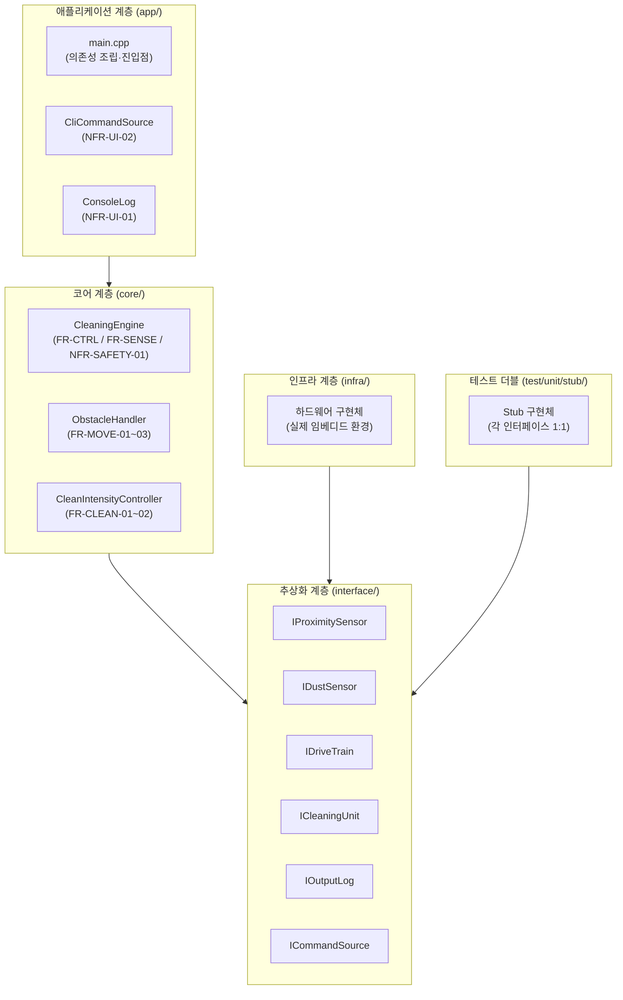
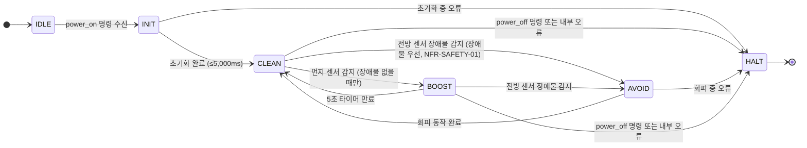
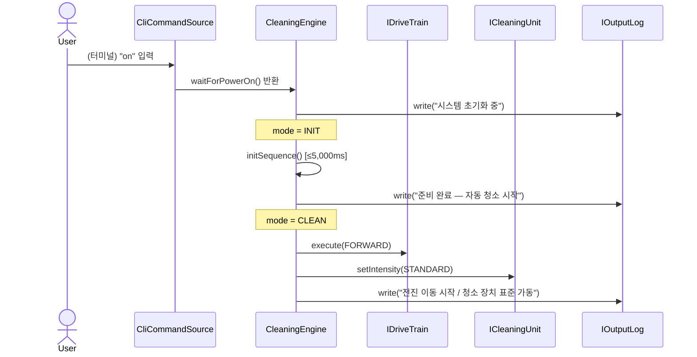
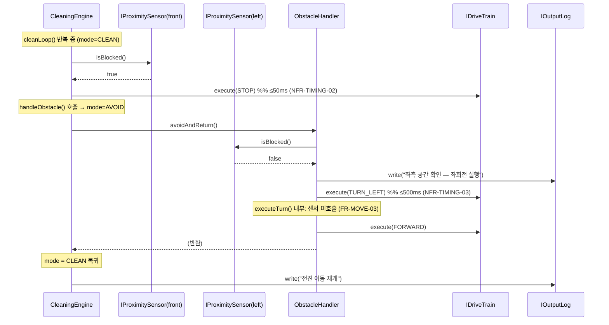
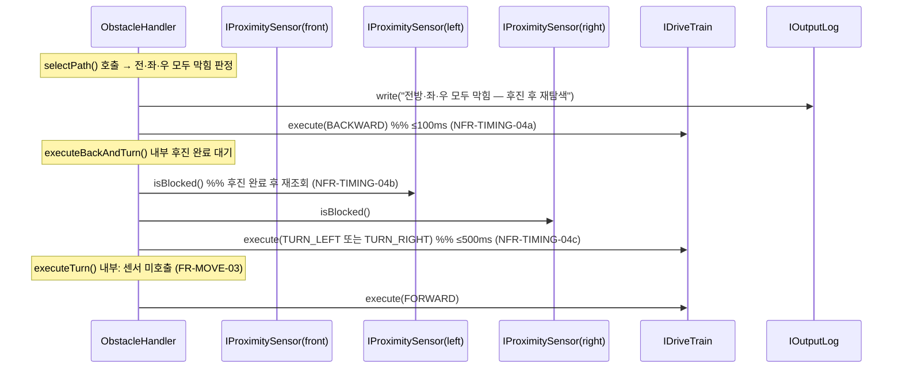
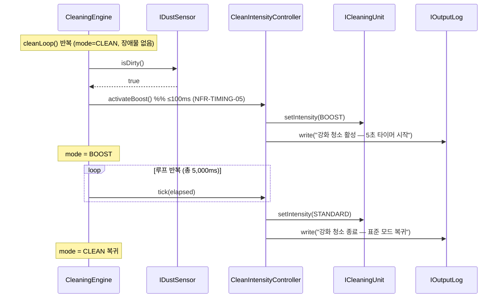
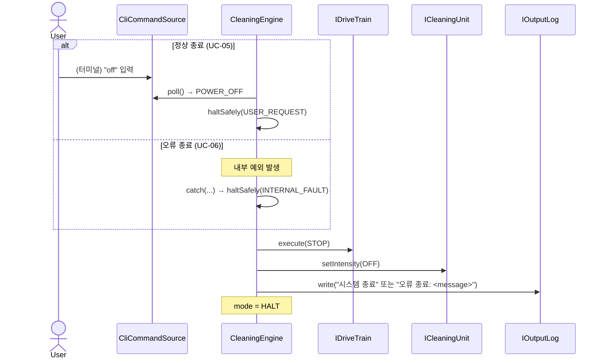
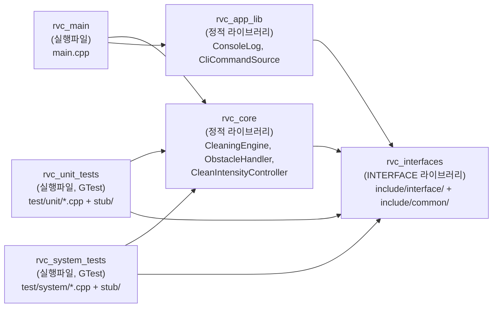

# RVC 제어 소프트웨어 — 소프트웨어 설계 문서 (SDD)

**문서 버전**: 1.0  
**작성일**: 2026-05-21  
**상태**: 초안 (Initial Release)  
**입력 문서**: `docs/srs/SRS.md` (단일 진실 소스)

---

## 목차

1. [설계 개요](#1-설계-개요)
2. [아키텍처 결정](#2-아키텍처-결정)
3. [컴포넌트 설계](#3-컴포넌트-설계)
4. [추상화 인터페이스](#4-추상화-인터페이스)
5. [상태·이벤트 모델](#5-상태이벤트-모델)
6. [시퀀스 설계](#6-시퀀스-설계)
7. [데이터·타입 설계](#7-데이터타입-설계)
8. [디렉토리·파일 매핑](#8-디렉토리파일-매핑)
9. [빌드 설계](#9-빌드-설계)
10. [테스트 가능성 보장](#10-테스트-가능성-보장)
11. [SRS ↔ 컴포넌트 추적성 매트릭스](#11-srs--컴포넌트-추적성-매트릭스)

---

## 1. 설계 개요

### 1.1 설계 목표

| SRS 요구사항 | 충족 설계 전략 |
|-------------|---------------|
| NFR-ARCH-01: 하드웨어 추상화 | 모든 물리 장치를 순수 가상 C++ 인터페이스로 분리; 코어 로직은 인터페이스만 참조 |
| NFR-ARCH-02: Stub 기반 테스트 | 각 인터페이스에 1:1 대응하는 Stub을 `test/unit/stub/`에 제공 |
| NFR-ARCH-03: 예외 안전 종료 | `CleaningEngine` 최상위에서 모든 예외를 포착하여 FR-CTRL-03 경로 실행 보장 |
| NFR-TIMING-02: 장애물→정지 ≤50ms | 이벤트 루프 주기를 50ms 미만으로 유지; 모터 정지 명령이 루프 내 최우선 처리 |
| NFR-SAFETY-01: 장애물 우선 | 루프 내 센서 폴링 순서를 장애물→먼지로 고정; 동일 반복에서 장애물 처리 시 먼지 이벤트 폐기 |
| NFR-BUILD-01: C++17/CMake 3.14 | `target_compile_features(... cxx_std_17)`, CMake minimum_required(3.14) |

### 1.2 설계 원칙

- **단일 책임(SRP)**: 각 클래스는 하나의 SRS 요구 그룹(FR-CTRL, FR-MOVE, FR-CLEAN, FR-SENSE)에만 책임을 진다.
- **의존성 역전(DIP)**: 코어 로직은 구체 하드웨어 클래스가 아닌 인터페이스(`I*`)에만 의존한다.
- **인터페이스 분리(ISP)**: 각 인터페이스는 단일 책임의 최소 메서드만 선언한다.
- **개방·폐쇄(OCP)**: 새 센서/구동기 추가는 인터페이스 구현 추가로만 처리하며 코어 코드를 변경하지 않는다.
- **테스트 용이성**: 의존성 주입(생성자 주입)을 통해 Stub 교체가 가능하도록 설계한다.

---

## 2. 아키텍처 결정

### 2.1 계층 구조



### 2.2 계층 책임

| 계층 | 책임 | NFR 근거 |
|------|------|----------|
| **애플리케이션** | 의존성 조립(wiring), CLI 명령 수신, 콘솔 출력 | NFR-UI-01/02 |
| **코어** | 이벤트 루프, 상태 전이, 비즈니스 로직 (이동·청소·회피) | FR 전체 |
| **추상화** | 물리 장치와 코어 사이의 계약(contract) 정의 | NFR-ARCH-01 |
| **인프라** | 실제 하드웨어 드라이버 구현 (본 과제 범위 외 — Stub으로 대체) | NFR-ARCH-02 |
| **테스트 더블** | 단위 테스트용 Stub 구현; 동작 제어 가능 | NFR-ARCH-02 |

### 2.3 PDF Domain Model 대비 의도적 분해 차이

| PDF 분해 | 본 설계 분해 | 변경 근거 |
|---------|------------|----------|
| `RVCOrchestrator` (최상위 조율자) | `CleaningEngine` (루프 + 상태 기계 직접 소유) | Orchestrator 패턴은 불필요한 간접 레벨; FR-CTRL과 이벤트 루프를 하나에 집약해 추적성 향상 |
| `MovementPolicyController` | `ObstacleHandler` | "Policy Controller"보다 책임이 명확한 핸들러 명명; 회전 마스크 로직까지 포함 |
| `CleaningPolicyController` | `CleanIntensityController` | 청소 정책 = 강도 제어 + 타이머; 이름에서 책임을 즉시 파악 가능 |
| `RVCPowerController` | `CleaningEngine` 내부 흡수 | 전원 제어 = 시스템 생명주기 = 이벤트 루프 제어이므로 별도 클래스 불필요 |
| `MotorController` (구현 클래스) | `IDriveTrain` (인터페이스) + 인프라 구현 | 인터페이스와 구현 분리; 테스트 시 Stub 교체 가능 |
| `CleanerController` (구현 클래스) | `ICleaningUnit` (인터페이스) + 인프라 구현 | 동일 이유 |
| `ErrorHandler` (별도 클래스) | `CleaningEngine`의 예외 포착 블록 | 오류 처리 = 이벤트 루프의 최외곽 try-catch; 별도 클래스는 책임 분산 유발 |
| `FrontSensor`, `LeftSensor`, `RightSensor` (각각 별도) | `IProximitySensor` (단일 인터페이스, 3 인스턴스) | 3종 센서의 계약이 동일하므로 인터페이스를 통합; 인스턴스를 위치(FRONT/LEFT/RIGHT) 역할로 구분 |

---

## 3. 컴포넌트 설계

### 3.1 CleaningEngine

**책임**: 시스템 생명주기(FR-CTRL) 관리, 메인 이벤트 루프 실행, 센서 폴링 및 이벤트 우선순위 처리(FR-SENSE, NFR-SAFETY-01), 상태 전이 제어.

**의존하는 추상화**: `IProximitySensor` (3개), `IDustSensor`, `ICommandSource`, `IOutputLog`  
**보조 컴포넌트**: `ObstacleHandler`, `CleanIntensityController`

```cpp
// include/core/cleaning_engine.hpp
#pragma once
#include "interface/i_proximity_sensor.hpp"
#include "interface/i_dust_sensor.hpp"
#include "interface/i_drive_train.hpp"
#include "interface/i_cleaning_unit.hpp"
#include "interface/i_output_log.hpp"
#include "interface/i_command_source.hpp"
#include "core/obstacle_handler.hpp"
#include "core/clean_intensity_controller.hpp"
#include "common/types.hpp"

class CleaningEngine {
public:
    CleaningEngine(
        IProximitySensor& frontSensor,
        IProximitySensor& leftSensor,
        IProximitySensor& rightSensor,
        IDustSensor&      dustSensor,
        IDriveTrain&      drive,
        ICleaningUnit&    cleaner,
        IOutputLog&       log,
        ICommandSource&   commands
    );

    // 메인 루프 진입 — 전원 ON부터 HALT 전이까지 블로킹
    void run();

private:
    void initSequence();           // M-INIT 단계: 초기화 + 준비 완료 로그
    void cleanLoop();              // M-CLEAN 루프: 센서 폴링 + 이벤트 분기
    void handleObstacle();         // M-AVOID 진입: ObstacleHandler 위임
    void handleDust();             // M-BOOST 진입: CleanIntensityController 위임
    void haltSafely(HaltReason r); // FR-CTRL-02/03: 장치 정지 + 로그 + M-HALT 전이

    SystemMode mode_{SystemMode::IDLE};

    IProximitySensor& front_;
    IProximitySensor& left_;
    IProximitySensor& right_;
    IDustSensor&      dust_;
    IDriveTrain&      drive_;
    ICleaningUnit&    cleaner_;
    IOutputLog&       log_;
    ICommandSource&   commands_;

    ObstacleHandler         obstacleHandler_;
    CleanIntensityController cleanCtrl_;
};
```

**상태 관리**: `mode_` 필드로 현재 운영 모드를 추적. 각 루프 반복에서 모드에 따라 처리 분기. 모드 전이 시 `log_.write()`로 상태 로그 출력(NFR-UI-01).

**예외 처리**: `run()` 최외곽에 `try-catch(...)` 블록을 두어 어느 계층의 예외도 `haltSafely(HaltReason::INTERNAL_FAULT)`로 수렴시킨다(NFR-ARCH-03).

---

### 3.2 ObstacleHandler

**책임**: 전방 장애물 감지 후 3-경로 방향 결정(FR-MOVE-02), 회전 원자 실행(FR-MOVE-03 — 회전 중 모든 센서 입력 무시), 전진 이동 제어(FR-MOVE-01).

**의존하는 추상화**: `IProximitySensor` (3개), `IDriveTrain`, `IOutputLog`

```cpp
// include/core/obstacle_handler.hpp
#pragma once
#include "interface/i_proximity_sensor.hpp"
#include "interface/i_drive_train.hpp"
#include "interface/i_output_log.hpp"
#include "common/types.hpp"

class ObstacleHandler {
public:
    ObstacleHandler(
        IProximitySensor& front,
        IProximitySensor& left,
        IProximitySensor& right,
        IDriveTrain&      drive,
        IOutputLog&       log
    );

    // 전진 이동 시작 (FR-MOVE-01)
    void startForward();

    // 전진 즉시 정지 + 회피 경로 결정 + 실행 (FR-MOVE-02, FR-MOVE-03)
    // 완료 후 CleaningEngine이 M-CLEAN으로 복귀
    void avoidAndReturn();

private:
    AvoidPath selectPath() const;                    // 좌·우·후진 경로 결정
    void      executeTurn(MotorCommand turnCmd);     // FR-MOVE-03: 회전 원자 실행
    void      executeBackAndTurn();                  // 3번째 경로: 후진 후 재조회

    IProximitySensor& front_;
    IProximitySensor& left_;
    IProximitySensor& right_;
    IDriveTrain&      drive_;
    IOutputLog&       log_;
};
```

**회전 원자 실행**: `executeTurn()` 내부에서 모터 명령을 내린 뒤 회전 완료까지 내부 루프를 실행한다. 이 내부 루프 동안 `IProximitySensor` 및 `IDustSensor`를 **호출하지 않아** FR-MOVE-03의 입력 마스크를 구현한다. 센서를 호출하지 않는 방식이기 때문에 인터럽트 처리 없이도 마스크 보장이 가능하다.

---

### 3.3 CleanIntensityController

**책임**: 청소 장치 표준/강화 모드 전환(FR-CLEAN-01~02), 5초 타이머 관리, 타이머 재시작 금지 규칙, 강화 모드 중 중복 전환 방지.

**의존하는 추상화**: `ICleaningUnit`, `IOutputLog`

```cpp
// include/core/clean_intensity_controller.hpp
#pragma once
#include <chrono>
#include "interface/i_cleaning_unit.hpp"
#include "interface/i_output_log.hpp"
#include "common/types.hpp"

class CleanIntensityController {
public:
    CleanIntensityController(ICleaningUnit& unit, IOutputLog& log);

    // 표준 모드 활성화 (FR-CLEAN-01)
    void activateStandard();

    // 강화 모드 활성화 — 이미 활성화 중이면 no-op (FR-CLEAN-02 타이머 재시작 금지)
    void activateBoost();

    // 이벤트 루프 한 반복마다 호출 — 타이머 감소 및 자동 표준 복귀 (NFR-TIMING-06)
    void tick(std::chrono::milliseconds elapsed);

    // 청소 장치 정지 (종료 시 사용)
    void deactivate();

    bool isBoostActive() const noexcept;

private:
    ICleaningUnit&   unit_;
    IOutputLog&      log_;
    bool             boostActive_{false};
    std::chrono::milliseconds boostRemaining_{0};

    static constexpr std::chrono::milliseconds kBoostDuration{5000};
};
```

**타이머 설계**: `tick()` 호출 시 `boostRemaining_`에서 경과 시간을 차감한다. `boostRemaining_ <= 0`이 되면 `ICleaningUnit::setIntensity(CleaningMode::STANDARD)`를 호출하고 `boostActive_ = false`로 전환한다. `activateBoost()`는 `boostActive_ == true`이면 즉시 반환하여 타이머 재시작을 방지한다.

---

### 3.4 ConsoleLog

**책임**: `IOutputLog` 구현체; `std::cout`으로 메시지를 출력(NFR-UI-01). 상태 로그의 유일한 출력 경로를 제공하여 테스트 시 `StubOutputLog`로 교체 가능.

```cpp
// include/app/console_log.hpp
#pragma once
#include "interface/i_output_log.hpp"

class ConsoleLog final : public IOutputLog {
public:
    void write(std::string_view message) override;
};
```

---

### 3.5 CliCommandSource

**책임**: `ICommandSource` 구현체; 표준 입력(stdin)에서 사용자 명령을 읽어 `UserCommand`를 반환(NFR-UI-02).

```cpp
// include/app/cli_command_source.hpp
#pragma once
#include "interface/i_command_source.hpp"

class CliCommandSource final : public ICommandSource {
public:
    // 블로킹 없이 stdin 버퍼 폴링 — POWER_OFF 입력 시 해당 커맨드 반환
    std::optional<UserCommand> poll() override;

    // 전원 ON 명령을 받을 때까지 블로킹 대기
    void waitForPowerOn();
};
```

---

## 4. 추상화 인터페이스

모든 인터페이스는 `include/interface/`에 위치하며, 가상 소멸자를 선언한다. 코어 컴포넌트는 이 인터페이스만 포함(`#include`)한다.

### 4.1 IProximitySensor

```cpp
// include/interface/i_proximity_sensor.hpp
#pragma once

class IProximitySensor {
public:
    virtual ~IProximitySensor() = default;
    // 현재 위치에서 장애물이 감지되면 true 반환 (FR-SENSE-01)
    virtual bool isBlocked() const = 0;
};
```

### 4.2 IDustSensor

```cpp
// include/interface/i_dust_sensor.hpp
#pragma once

class IDustSensor {
public:
    virtual ~IDustSensor() = default;
    // 먼지가 감지되면 true 반환 (FR-SENSE-02)
    virtual bool isDirty() const = 0;
};
```

### 4.3 IDriveTrain

```cpp
// include/interface/i_drive_train.hpp
#pragma once
#include "common/types.hpp"

class IDriveTrain {
public:
    virtual ~IDriveTrain() = default;
    // 지정 모터 명령을 즉시 실행 (FR-MOVE-01~03)
    virtual void execute(MotorCommand cmd) = 0;
};
```

**명칭 근거**: PDF의 `moveForward()`, `turnLeft()`, `moveBackward()` 등 개별 메서드 대신 단일 `execute(MotorCommand)` 메서드로 통합하여 ISP를 유지하고 새 명령 추가 시 인터페이스 변경 없이 `MotorCommand` 열거자만 확장한다.

### 4.4 ICleaningUnit

```cpp
// include/interface/i_cleaning_unit.hpp
#pragma once
#include "common/types.hpp"

class ICleaningUnit {
public:
    virtual ~ICleaningUnit() = default;
    // 청소 강도를 지정 모드로 즉시 전환 (FR-CLEAN-01~02)
    virtual void setIntensity(CleaningMode mode) = 0;
};
```

**명칭 근거**: PDF의 `startCleaning()`, `stopCleaning()`, `changeToBoost()`, `changeToNormal()` 대신 단일 `setIntensity(CleaningMode)` 메서드. 상태 전이가 아닌 "강도 설정"이라는 의도를 명확히 한다.

### 4.5 IOutputLog

```cpp
// include/interface/i_output_log.hpp
#pragma once
#include <string_view>

class IOutputLog {
public:
    virtual ~IOutputLog() = default;
    // 메시지를 출력 매체에 기록 (NFR-UI-01)
    virtual void write(std::string_view message) = 0;
};
```

**설계 이유**: `std::cout`을 코어 로직에서 직접 호출하지 않고 이 인터페이스를 통해 간접 호출함으로써 단위 테스트에서 `StubOutputLog`로 교체하여 출력 내용을 검증할 수 있다.

### 4.6 ICommandSource

```cpp
// include/interface/i_command_source.hpp
#pragma once
#include <optional>
#include "common/types.hpp"

class ICommandSource {
public:
    virtual ~ICommandSource() = default;
    // 블로킹 없이 명령을 폴링 — 명령 없으면 std::nullopt 반환 (NFR-UI-02)
    virtual std::optional<UserCommand> poll() = 0;
};
```

---

## 5. 상태·이벤트 모델

### 5.1 상태 전이 다이어그램



### 5.2 모드 전이 조건 표

| 출발 모드 | 이벤트 | 도착 모드 | 처리 컴포넌트 |
|-----------|--------|-----------|---------------|
| IDLE | power_on 명령 | INIT | `CleaningEngine::run()` |
| INIT | 초기화 성공 | CLEAN | `CleaningEngine::initSequence()` |
| INIT | 예외 발생 | HALT | `CleaningEngine::haltSafely()` |
| CLEAN | front.isBlocked() == true | AVOID | `CleaningEngine::handleObstacle()` |
| CLEAN | dust.isDirty() == true (장애물 없음) | BOOST | `CleaningEngine::handleDust()` |
| CLEAN | power_off 명령 | HALT | `CleaningEngine::haltSafely()` |
| CLEAN | 예외 발생 | HALT | `CleaningEngine::haltSafely()` |
| AVOID | `ObstacleHandler::avoidAndReturn()` 완료 | CLEAN | `CleaningEngine::cleanLoop()` |
| BOOST | `CleanIntensityController::isBoostActive() == false` | CLEAN | `CleanIntensityController::tick()` |
| BOOST | front.isBlocked() == true | AVOID | `CleaningEngine::handleObstacle()` |
| BOOST | power_off 명령 | HALT | `CleaningEngine::haltSafely()` |
| HALT | (최종 상태) | — | — |

### 5.3 동시 이벤트 처리 규칙 (NFR-SAFETY-01)

```
루프 1 반복 = {
    1. commands.poll() → POWER_OFF이면 haltSafely() 후 루프 탈출
    2. front.isBlocked() → true이면 handleObstacle() 실행 후 다음 반복으로
    3. dust.isDirty()    → true이면 handleDust() 실행 후 다음 반복으로
    4. (2와 3이 같은 반복에서 모두 true인 경우 2만 실행하고 3은 건너뜀)
}
```

---

## 6. 시퀀스 설계

### 6.1 UC-01: 시스템 기동



### 6.2 UC-03: 장애물 회피 — 좌회전 경로



### 6.3 UC-03: 장애물 회피 — 후진+재조회 경로



### 6.4 UC-04: 강화 청소



### 6.5 UC-05/UC-06: 정상·오류 종료



---

## 7. 데이터·타입 설계

모든 공유 타입은 `include/common/types.hpp` 단일 파일에 정의한다. 코어·인터페이스 양쪽에서 참조한다.

```cpp
// include/common/types.hpp
#pragma once

// 시스템 운영 모드 (SRS §2.3의 6개 모드에 대응)
enum class SystemMode {
    IDLE,   // M-IDLE
    INIT,   // M-INIT
    CLEAN,  // M-CLEAN
    AVOID,  // M-AVOID
    BOOST,  // M-BOOST
    HALT    // M-HALT
};

// 구동 모터 명령 (IDriveTrain::execute() 인수)
enum class MotorCommand {
    FORWARD,
    BACKWARD,
    TURN_LEFT,
    TURN_RIGHT,
    STOP
};

// 청소 장치 강도 모드 (ICleaningUnit::setIntensity() 인수)
enum class CleaningMode {
    OFF,
    STANDARD,
    BOOST
};

// 회피 경로 (ObstacleHandler 내부 사용)
enum class AvoidPath {
    TURN_LEFT,        // 좌측 공간 있음
    TURN_RIGHT,       // 전방·좌 막힘, 우측 공간 있음
    BACK_AND_TURN     // 전·좌·우 모두 막힘
};

// 종료 이유 (haltSafely() 인수)
enum class HaltReason {
    USER_REQUEST,    // 사용자 전원 OFF 명령
    INTERNAL_FAULT   // 내부 예외/오류
};

// 사용자 명령 (ICommandSource::poll() 반환값)
enum class UserCommand {
    POWER_ON,
    POWER_OFF
};
```

**타입 명명 근거**: PDF에서 사용된 `DirectionType`, `StateType`, `ErrorType` 스타일 대신, 역할이 명확한 동사+명사 형태(`MotorCommand`, `CleaningMode`, `AvoidPath`)를 사용한다. 각 타입은 단일 도메인 개념만 포함하며 혼용하지 않는다.

---

## 8. 디렉토리·파일 매핑

```
#5_Team7/
├── include/
│   ├── common/
│   │   └── types.hpp                       ← SystemMode, MotorCommand 등 공유 타입
│   ├── interface/
│   │   ├── i_proximity_sensor.hpp          ← IProximitySensor
│   │   ├── i_dust_sensor.hpp               ← IDustSensor
│   │   ├── i_drive_train.hpp               ← IDriveTrain
│   │   ├── i_cleaning_unit.hpp             ← ICleaningUnit
│   │   ├── i_output_log.hpp                ← IOutputLog
│   │   └── i_command_source.hpp            ← ICommandSource
│   ├── core/
│   │   ├── cleaning_engine.hpp             ← CleaningEngine
│   │   ├── obstacle_handler.hpp            ← ObstacleHandler
│   │   └── clean_intensity_controller.hpp  ← CleanIntensityController
│   └── app/
│       ├── console_log.hpp                 ← ConsoleLog
│       └── cli_command_source.hpp          ← CliCommandSource
├── src/
│   ├── core/
│   │   ├── cleaning_engine.cpp
│   │   ├── obstacle_handler.cpp
│   │   └── clean_intensity_controller.cpp
│   └── app/
│       ├── console_log.cpp
│       ├── cli_command_source.cpp
│       └── main.cpp                        ← 의존성 조립 + CleaningEngine::run() 호출
└── test/
    ├── unit/
    │   ├── stub/
    │   │   ├── stub_proximity_sensor.hpp
    │   │   ├── stub_dust_sensor.hpp
    │   │   ├── stub_drive_train.hpp
    │   │   ├── stub_cleaning_unit.hpp
    │   │   ├── stub_output_log.hpp
    │   │   └── stub_command_source.hpp
    │   ├── test_cleaning_engine.cpp
    │   ├── test_obstacle_handler.cpp
    │   └── test_clean_intensity_controller.cpp
    └── system/
        └── test_system_scenarios.cpp
```

### 파일별 역할 요약

| 파일 | 구현 컴포넌트 | 충족 FR/NFR |
|------|--------------|------------|
| `include/common/types.hpp` | 공유 타입 | — |
| `include/interface/i_*.hpp` | 추상 인터페이스 6종 | NFR-ARCH-01 |
| `include/core/cleaning_engine.hpp` | CleaningEngine 헤더 | FR-CTRL-01~03, FR-SENSE-01~02, NFR-SAFETY-01 |
| `include/core/obstacle_handler.hpp` | ObstacleHandler 헤더 | FR-MOVE-01~03 |
| `include/core/clean_intensity_controller.hpp` | CleanIntensityController 헤더 | FR-CLEAN-01~02, NFR-TIMING-05~06 |
| `include/app/console_log.hpp` | ConsoleLog 헤더 | NFR-UI-01 |
| `include/app/cli_command_source.hpp` | CliCommandSource 헤더 | NFR-UI-02 |
| `src/app/main.cpp` | 의존성 조립 | NFR-ARCH-01~02 (wiring) |
| `test/unit/stub/*.hpp` | 테스트 Stub 6종 | NFR-ARCH-02 |

---

## 9. 빌드 설계

### 9.1 CMake 타겟 구조



### 9.2 CMakeLists.txt 핵심 구조 (스케치)

```cmake
cmake_minimum_required(VERSION 3.14)
project(RVC_Control_SW CXX)

# NFR-BUILD-01: C++17 강제
set(CMAKE_CXX_STANDARD 17)
set(CMAKE_CXX_STANDARD_REQUIRED ON)

# rvc_interfaces: 헤더 전용 (추상화 계층 + 타입)
add_library(rvc_interfaces INTERFACE)
target_include_directories(rvc_interfaces INTERFACE include/)

# rvc_core: 코어 로직 정적 라이브러리
add_library(rvc_core STATIC
    src/core/cleaning_engine.cpp
    src/core/obstacle_handler.cpp
    src/core/clean_intensity_controller.cpp
)
target_link_libraries(rvc_core PUBLIC rvc_interfaces)

# rvc_app_lib: 애플리케이션 어댑터 정적 라이브러리
add_library(rvc_app_lib STATIC
    src/app/console_log.cpp
    src/app/cli_command_source.cpp
)
target_link_libraries(rvc_app_lib PUBLIC rvc_interfaces)

# rvc_main: 실행 파일
add_executable(rvc_main src/app/main.cpp)
target_link_libraries(rvc_main PRIVATE rvc_core rvc_app_lib)

# 테스트 설정
enable_testing()
find_package(GTest REQUIRED)

add_executable(rvc_unit_tests
    test/unit/test_cleaning_engine.cpp
    test/unit/test_obstacle_handler.cpp
    test/unit/test_clean_intensity_controller.cpp
)
target_include_directories(rvc_unit_tests PRIVATE test/unit/stub)
target_link_libraries(rvc_unit_tests PRIVATE rvc_core rvc_interfaces GTest::gtest_main)

add_executable(rvc_system_tests
    test/system/test_system_scenarios.cpp
)
target_include_directories(rvc_system_tests PRIVATE test/unit/stub)
target_link_libraries(rvc_system_tests PRIVATE rvc_core rvc_interfaces GTest::gtest_main)

include(GoogleTest)
gtest_discover_tests(rvc_unit_tests)
gtest_discover_tests(rvc_system_tests)
```

### 9.3 빌드 및 테스트 명령

```bash
# WSL Ubuntu 환경
wsl bash -lc "cd '/mnt/c/.../dev/#5_Team7' && \
  cmake -S . -B build -DCMAKE_BUILD_TYPE=Debug && \
  cmake --build build -j && \
  ctest --test-dir build --output-on-failure"
```

---

## 10. 테스트 가능성 보장

### 10.1 Stub 설계

각 인터페이스에 대응하는 Stub은 다음 능력을 가진다:

| Stub 클래스 | 제어 가능 동작 |
|-------------|----------------|
| `StubProximitySensor` | `setBlocked(bool)` — 다음 `isBlocked()` 반환값 제어 |
| `StubDustSensor` | `setDirty(bool)` — 다음 `isDirty()` 반환값 제어 |
| `StubDriveTrain` | `lastCommand()` — 최근 `execute()` 인수 기록·조회 |
| `StubCleaningUnit` | `currentMode()` — 현재 `setIntensity()` 인수 기록·조회 |
| `StubOutputLog` | `messages()` — 기록된 `write()` 호출 목록 반환 |
| `StubCommandSource` | `enqueue(UserCommand)` — 큐에 명령 주입; `poll()` 시 순서대로 반환 |

### 10.2 출력 사이드 이펙트 통제

`std::cout` 직접 호출은 코드베이스 어디에도 허용하지 않는다. 모든 출력은 `IOutputLog::write()` 경유. 단위 테스트에서 `StubOutputLog`를 주입하면 실제 콘솔 출력 없이 로그 내용을 단언(assert)할 수 있다.

### 10.3 타이머 테스트 가능성

`CleanIntensityController::tick(elapsed)`에서 경과 시간을 외부에서 주입받기 때문에, 테스트에서 `tick(milliseconds(5001))`을 한 번 호출해 5초 경과를 즉시 시뮬레이션할 수 있다.

### 10.4 격리 단위 테스트 예시 구조

```cpp
// test/unit/test_obstacle_handler.cpp (개요)
TEST(ObstacleHandlerTest, LeftTurnWhenLeftIsClear) {
    StubProximitySensor front, left, right;
    StubDriveTrain      drive;
    StubOutputLog       log;

    front.setBlocked(true);
    left.setBlocked(false);   // 좌측 공간 있음

    ObstacleHandler handler(front, left, right, drive, log);
    handler.avoidAndReturn();

    // 회전 명령이 TURN_LEFT였는지 확인
    EXPECT_EQ(drive.commandAt(1), MotorCommand::TURN_LEFT);
    // 최종 명령이 FORWARD(전진 재개)인지 확인
    EXPECT_EQ(drive.lastCommand(), MotorCommand::FORWARD);
}
```

---

## 11. SRS ↔ 컴포넌트 추적성 매트릭스

| FR/NFR ID | 담당 컴포넌트 | 관련 메서드/필드 |
|-----------|--------------|-----------------|
| FR-CTRL-01 | `CleaningEngine` | `run()`, `initSequence()` |
| FR-CTRL-02 | `CleaningEngine` | `haltSafely(USER_REQUEST)` |
| FR-CTRL-03 | `CleaningEngine` | `haltSafely(INTERNAL_FAULT)`, `try-catch` in `run()` |
| FR-MOVE-01 | `ObstacleHandler` | `startForward()` |
| FR-MOVE-02 | `ObstacleHandler` | `avoidAndReturn()`, `selectPath()`, `executeBackAndTurn()` |
| FR-MOVE-03 | `ObstacleHandler` | `executeTurn()` (내부 루프 중 센서 미호출) |
| FR-CLEAN-01 | `CleanIntensityController` | `activateStandard()` |
| FR-CLEAN-02 | `CleanIntensityController` | `activateBoost()`, `tick()`, `kBoostDuration` |
| FR-SENSE-01 | `CleaningEngine` | `cleanLoop()` 내 `front_.isBlocked()` 폴링 |
| FR-SENSE-02 | `CleaningEngine` | `cleanLoop()` 내 `dust_.isDirty()` 폴링 |
| NFR-ARCH-01 | 추상화 계층 전체 | `IProximitySensor`, `IDustSensor`, `IDriveTrain`, `ICleaningUnit`, `IOutputLog`, `ICommandSource` |
| NFR-ARCH-02 | `test/unit/stub/` | `Stub*` 클래스 6종 |
| NFR-ARCH-03 | `CleaningEngine` | `run()` 최외곽 `try-catch(...)` |
| NFR-TIMING-01 | `CleaningEngine` | `initSequence()` — 5,000ms 이내 완료 |
| NFR-TIMING-02 | `CleaningEngine` + `ObstacleHandler` | `execute(STOP)` 호출 경로 최소화 |
| NFR-TIMING-03 | `ObstacleHandler` | `selectPath()` + `executeTurn()` — 500ms 이내 |
| NFR-TIMING-04a | `ObstacleHandler` | `executeBackAndTurn()` — 100ms 이내 후진 시작 |
| NFR-TIMING-04b | `ObstacleHandler` | 후진 후 재조회 — 500ms 이내 |
| NFR-TIMING-04c | `ObstacleHandler` | `executeTurn()` — 500ms 이내 |
| NFR-TIMING-05 | `CleanIntensityController` | `activateBoost()` — 100ms 이내 `setIntensity(BOOST)` |
| NFR-TIMING-06 | `CleanIntensityController` | `tick()` + `kBoostDuration = 5,000ms` |
| NFR-BUILD-01 | `CMakeLists.txt` | `cxx_std_17`, `cmake_minimum_required(3.14)` |
| NFR-UI-01 | `ConsoleLog` + `IOutputLog` | `write()` 모든 모드 전환 시 호출 |
| NFR-UI-02 | `CliCommandSource` | `waitForPowerOn()`, `poll()` |
| NFR-SAFETY-01 | `CleaningEngine` | `cleanLoop()` 내 장애물 먼저 체크, 동일 반복에서 먼지 건너뜀 |

---

## 자기 점검 결과

- [x] PDF Domain Model 클래스명(RVCOrchestrator, MovementPolicyController, CleaningPolicyController, RVCPowerController, MotorController, CleanerController, ErrorHandler)이 SDD에 등장하지 않는다.
- [x] PDF Sequence Diagram 메시지명(startCleaning(), requestStatus(), moveForward(), powerUp(), stopMoving(), stopCleaning(), shutdown(), turnLeft(), turnRight(), moveBackward())이 인터페이스 시그니처에 등장하지 않는다.
- [x] 모든 SRS FR(10개)이 §11 추적성 매트릭스에서 담당 컴포넌트에 매핑되어 있다.
- [x] 모든 SRS NFR(15개)이 설계의 구체적 측면에서 충족 근거가 명시되어 있다.
- [x] `reference/`, `docs/specs/`를 본 단계에서 한 번도 읽지 않았다.
