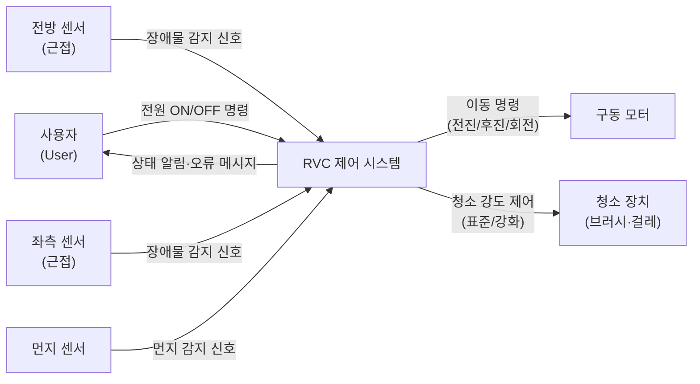

# RVC 제어 소프트웨어 — 시스템 개요

> **유지보수 노트 (TP#6)**: `legacy/docs/specs/system-overview.md`를 인계받아 **오른쪽 근접 센서 삭제(센서 3→2)** 만 반영. 변경/일치는 문서 끝에 표기.

## 1. 시스템 정의

RVC(Robot Vacuum Cleaner) 제어 소프트웨어는 자율 주행 로봇 청소기의 동작 전반을 관장하는 임베디드 제어 SW이다. 이 시스템은 근접 센서와 먼지 센서로부터 실시간 입력을 받아 이동 방향을 결정하고, 청소 강도를 조절하며, 이상 상황 발생 시 안전하게 종료한다. 사용자는 CLI를 통해 시스템을 기동·종료하며, 시스템은 그 사이에 완전 자율적으로 동작한다. 물리적 하드웨어에 대한 직접 의존을 추상화 계층으로 분리하여 테스트 용이성과 유지보수성을 동시에 확보하는 것이 이 소프트웨어의 핵심 설계 목표이다.

---

## 2. 외부 환경 모델

> **입력**: 사용자 명령(CLI), 전방·좌측 근접 센서(bool), 먼지 센서(bool)  
> **출력**: 모터 이동 명령(전진/후진/좌회전/우회전/정지), 청소 장치 강도 제어, 터미널 상태 로그

---

## 3. 운영 모드

시스템은 아래 6개 모드를 갖는다. 모드 전환은 센서 이벤트·사용자 명령·타이머 만료에 의해 결정된다.

| 모드 ID | 명칭 | 설명 | 진입 조건 | 탈출 조건 |
|---------|------|------|-----------|-----------|
| M-IDLE | 오프라인 | 전원 꺼짐, 모든 장치 정지 | 초기 상태 또는 정상·오류 종료 후 | 사용자 전원 ON |
| M-INIT | 초기화 | 내부 구성 요소 초기화, 자가 점검 | 전원 ON 명령 수신 | 초기화 완료 (≤5s) 또는 오류 |
| M-CLEAN | 표준 청소 | 전진 이동 + 청소 장치 표준 가동 | 초기화 완료 또는 회피·강화 완료 후 복귀 | 장애물 감지, 먼지 감지, 전원 OFF, 오류 |
| M-AVOID | 장애물 회피 | 전진 정지, 센서 조회, 방향 전환 | 전방 장애물 감지 | 회전 또는 후진+회전 완료 |
| M-BOOST | 강화 청소 | 청소 강도 상승 + 5초 타이머 | 먼지 감지 (표준 또는 강화 청소 중) | 5초 타이머 만료 |
| M-HALT | 종료 | 모든 장치 정지, 사용자 알림 | 전원 OFF 명령 또는 내부 오류 | 해당 없음 (최종 상태) |

**상태 전환 우선순위 규칙**:
- M-CLEAN 중 장애물 감지와 먼지 감지가 동시에 발생하면 → 장애물 회피(M-AVOID)를 먼저 처리
- M-AVOID(회전 중)에는 모든 센서 입력을 무시, 회전 완료 후 재평가
- M-BOOST 중 먼지 재감지는 무시(타이머 재시작 없음); 장애물 감지는 그대로 M-AVOID 전이

---

## 4. 설계에서 가장 강한 NFR

다음 4개 제약은 아키텍처·구현·테스트 전략에 직접적인 영향을 미친다.

| ID | 제약 | 영향 |
|----|------|------|
| NFR-BUILD-01 | C++17 + CMake ≥ 3.14, Ubuntu GCC | 모든 코드·헤더·빌드 스크립트가 이 환경을 기준으로 작성되어야 한다. |
| NFR-ARCH-01 | 하드웨어 인터페이스를 순수 추상 클래스로 분리 | 구동부·센서·청소 장치 각각에 추상 인터페이스 필요; 실제 구현과 Stub 구현을 교체 가능해야 한다. |
| NFR-TIMING-02 | 장애물 감지 → 전진 정지 ≤ 50ms | 이벤트 루프 주기가 이 지연을 만족하도록 설계되어야 한다. |
| NFR-SAFETY-01 | 장애물 우선 > 먼지 우선 | 두 센서 이벤트가 동시에 처리 대기 중일 때 처리 순서를 코드에 명시해야 한다. |

---

## 변경 이력 (TP#6 유지보수)

| 항목 | legacy 대비 | 내용 |
|---|---|---|
| §2 다이어그램 `RS["우측 센서"]` 노드 | 변경 | 삭제 |
| §2 입력 설명 "전방·좌·우 근접 센서" | 변경 | "전방·좌측 근접 센서" |
| §1 시스템 정의, §3 운영 모드, §4 NFR | 일치 | 방향 비특정·센서 무관이라 legacy 그대로 |
