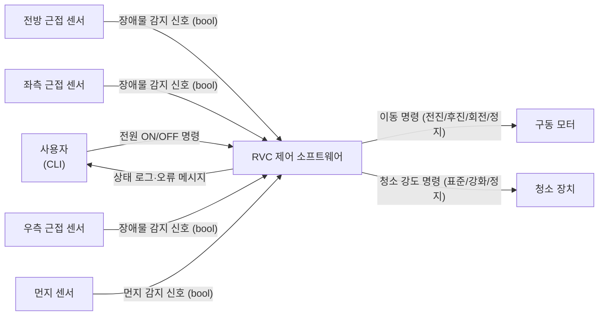

# RVC 제어 소프트웨어 — 소프트웨어 요구사항 명세서 (SRS)

**문서 버전**: 1.0  
**작성일**: 2026-05-21  
**상태**: 초안 (Initial Release)

---

## 목차

1. [문서 개요](#1-문서-개요)
2. [시스템 개요](#2-시스템-개요)
3. [기능 요구사항](#3-기능-요구사항-fr)
4. [비기능 요구사항](#4-비기능-요구사항-nfr)
5. [유스케이스](#5-유스케이스-uc)
6. [외부 인터페이스](#6-외부-인터페이스)
7. [추적성 매트릭스](#7-추적성-매트릭스)

---

## 1. 문서 개요

### 1.1 목적

본 문서는 RVC(Robot Vacuum Cleaner) 제어 소프트웨어의 소프트웨어 요구사항 명세서(SRS)이다. 개발 팀과 검증 팀이 "무엇을 구현해야 하는가"를 공통으로 이해할 수 있는 단일 기준 문서 역할을 한다. 구현 방법(클래스 구조, 알고리즘 선택 등)은 별도의 SDD에서 결정한다.

### 1.2 범위

본 SRS가 다루는 시스템은 자율 주행 로봇 청소기의 제어 소프트웨어 전체이다. 물리적 하드웨어(모터, 센서, 청소 장치) 자체는 범위에서 제외되며, 이들과의 인터페이스 경계를 명세한다.

### 1.3 정의 및 약어

| 약어/용어 | 정의 |
|-----------|------|
| RVC | Robot Vacuum Cleaner — 자율 주행 로봇 청소기 |
| FR | Functional Requirement — 기능 요구사항 |
| NFR | Non-Functional Requirement — 비기능 요구사항 |
| UC | Use Case — 유스케이스 |
| CLI | Command Line Interface — 명령줄 인터페이스 |
| 표준 모드 | 청소 장치의 기본 작동 강도 상태 |
| 강화 모드 | 먼지 감지 시 청소 장치가 최대 강도로 전환된 상태 |
| 입력 마스크 | 특정 동작 중 센서 신호를 의도적으로 무시하는 규칙 |
| Stub | 물리 하드웨어를 대신하는 테스트용 가짜 구현체 |

### 1.4 참고 문서

본 SRS는 아래 문서만을 입력으로 사용하였다. `reference/` 폴더의 PDF 및 이전 학기 코드는 `/extract-specs` 단계에서 재증류에 사용되었으며, 본 단계에서는 참조하지 않는다.

- `docs/specs/system-overview.md` — 시스템 개요 (재증류)
- `docs/specs/requirements.md` — 기능·비기능 요구사항 (재증류)
- `docs/specs/use-cases.md` — 유스케이스 명세 (재증류)

---

## 2. 시스템 개요

### 2.1 시스템 컨텍스트

RVC 제어 소프트웨어는 물리적 환경과 사용자 명령을 입력으로 받아 로봇의 이동·청소 동작을 제어하는 임베디드 제어 SW이다. 시스템은 4종의 센서에서 실시간 이벤트를 받고, 3종의 물리 장치에 명령을 내린다.

### 2.2 외부 액터

| 액터 | 종류 | 시스템과의 상호작용 |
|------|------|---------------------|
| 사용자 | 인간 | CLI를 통해 전원 ON/OFF 명령 입력; 상태 로그 수신 |
| 전방 근접 센서 | 물리 장치 | 전방 장애물 감지 시 신호 전달 (bool) |
| 좌측 근접 센서 | 물리 장치 | 좌측 장애물 감지 시 신호 전달 (bool) |
| 우측 근접 센서 | 물리 장치 | 우측 장애물 감지 시 신호 전달 (bool) |
| 먼지 센서 | 물리 장치 | 먼지 감지 시 신호 전달 (bool) |
| 구동 모터 | 물리 장치 | 이동 명령을 수신하여 로봇을 이동시킴 |
| 청소 장치 | 물리 장치 | 청소 강도 명령을 수신하여 브러시·걸레를 제어 |

### 2.3 운영 모드

시스템은 6개의 운영 모드를 가지며, 이벤트와 명령에 따라 전환된다.

| 모드 ID | 명칭 | 설명 | 진입 조건 | 탈출 조건 |
|---------|------|------|-----------|-----------|
| M-IDLE | 오프라인 | 전원 꺼짐; 모든 장치 정지 | 초기 상태, 또는 정상·오류 종료 후 | 사용자 전원 ON |
| M-INIT | 초기화 | 내부 구성 요소 초기화 및 자가 점검 | 전원 ON 명령 수신 | 초기화 완료(≤5s) 또는 오류 |
| M-CLEAN | 표준 청소 | 전진 이동 + 청소 장치 표준 강도 가동 | 초기화 완료, 또는 회피·강화 완료 후 복귀 | 장애물 감지, 먼지 감지, 전원 OFF, 오류 |
| M-AVOID | 장애물 회피 | 전진 정지 → 센서 조회 → 방향 전환 | 전방 장애물 감지 | 회전 또는 후진+회전 완료 |
| M-BOOST | 강화 청소 | 청소 강도 최대 + 5초 타이머 | 먼지 감지 (M-CLEAN 또는 M-BOOST 중) | 5초 타이머 만료 |
| M-HALT | 종료 | 모든 장치 정지, 사용자 알림 | 전원 OFF 명령 또는 내부 오류 | 해당 없음 (최종 상태) |

**모드 전환 우선순위**:
- M-CLEAN 중 장애물 감지와 먼지 감지가 동시에 발생하면 장애물 회피(M-AVOID)를 먼저 처리하고, 해당 사이클의 먼지 이벤트는 폐기한다.
- M-AVOID(회전 실행 중)에는 모든 센서 입력을 무시하고 회전을 완수한 뒤 재평가한다.
- M-BOOST 중 먼지 재감지는 무시(타이머 재시작 없음); 장애물 감지는 M-AVOID로 전이하고, M-AVOID 완료 후 M-BOOST를 유지하여 복귀한다.

---

## 3. 기능 요구사항 (FR)

> **표기 규약**: 각 FR은 "조건 → 시스템 동작 → 사후 상태"의 형식으로 기술하며, 검증 시 사용할 측정 기준을 명시한다.

---

### 3.1 시스템 생명주기 제어 (FR-CTRL)

#### FR-CTRL-01 — 시스템 기동

| 항목 | 내용 |
|------|------|
| **ID** | FR-CTRL-01 |
| **요구사항** | 사용자가 CLI에서 전원 켜기 명령을 입력하면, 시스템은 내부 구성 요소를 초기화하고 준비 완료를 표준 출력에 알린 뒤 자동 청소 루프(FR-CLEAN-01)로 진입해야 한다. |
| **사전 조건** | 시스템이 M-IDLE(오프라인) 상태 |
| **사후 조건** | 시스템이 M-CLEAN 상태에서 전진 이동 및 청소 장치 가동 중 |
| **측정 기준** | 전원 ON 명령 수신 후 5,000ms 이내에 자동 청소 루프 첫 반복이 시작됨을 확인한다. (NFR-TIMING-01) |
| **우선순위** | 필수 |

#### FR-CTRL-02 — 정상 종료

| 항목 | 내용 |
|------|------|
| **ID** | FR-CTRL-02 |
| **요구사항** | 사용자가 CLI에서 전원 끄기 명령을 입력하면, 시스템은 진행 중인 모든 이동·청소 동작을 중지하고, 구동 모터와 청소 장치를 안전하게 정지한 뒤 종료 메시지를 표준 출력에 출력하고 M-IDLE 상태로 전환해야 한다. |
| **사전 조건** | 시스템이 활성 상태 (M-CLEAN, M-AVOID, M-BOOST 중 하나) |
| **사후 조건** | 구동 모터 및 청소 장치 정지; 시스템 M-IDLE 상태 |
| **측정 기준** | "시스템 종료" 로그 출력 후 모든 구동 장치가 정지 상태임을 확인한다. |
| **우선순위** | 필수 |

#### FR-CTRL-03 — 오류·예외 종료

| 항목 | 내용 |
|------|------|
| **ID** | FR-CTRL-03 |
| **요구사항** | 시스템 내 어느 구성 요소에서든 복구 불가능한 예외 또는 오류가 감지되면, 시스템은 오류 내용을 표준 출력에 즉시 알리고 FR-CTRL-02와 동일한 정지 절차를 수행한 뒤 M-IDLE 상태로 전환해야 한다. |
| **사전 조건** | 시스템 활성 상태 임의 |
| **사후 조건** | 오류 메시지 로그 출력; 모든 구동 장치 정지; 시스템 M-IDLE 상태 |
| **측정 기준** | 오류 메시지 로그 출력 + 모든 구동 장치 정지 상태 확인 |
| **우선순위** | 필수 |

---

### 3.2 이동·방향 제어 (FR-MOVE)

#### FR-MOVE-01 — 전진 이동

| 항목 | 내용 |
|------|------|
| **ID** | FR-MOVE-01 |
| **요구사항** | 자동 청소 루프가 활성화되면(M-CLEAN 진입 시), 시스템은 구동 모터를 통해 로봇을 전방으로 이동시켜야 한다. 이동은 장애물 감지, 종료 명령, 또는 오류가 발생하기 전까지 지속된다. |
| **사전 조건** | M-CLEAN 상태 |
| **사후 조건** | 구동 모터가 전진 방향으로 작동 중 |
| **측정 기준** | "전진 이동 시작" 로그 출력 + 모터 전진 명령 발생 확인 |
| **우선순위** | 필수 |

#### FR-MOVE-02 — 장애물 회피 (3-경로 결정)

| 항목 | 내용 |
|------|------|
| **ID** | FR-MOVE-02 |
| **요구사항** | 전방 장애물이 감지되면 시스템은 전진 이동을 즉시 중지하고, 좌·우측 센서 상태를 조회하여 아래 결정 표에 따라 이동 방향을 전환해야 한다. 방향 전환 완료 후 전진 이동을 재개한다. |
| **사전 조건** | M-CLEAN 상태에서 전방 센서 감지 신호 수신 |
| **사후 조건** | 방향 전환 완료 후 M-CLEAN 복귀, 전진 이동 재개 |
| **우선순위** | 필수 |

**방향 결정 표**:

| 전방 | 좌측 | 우측 | 실행 동작 |
|------|------|------|-----------|
| 막힘 | 비어 있음 | 무관 | 좌회전 → 전진 재개 |
| 막힘 | 막힘 | 비어 있음 | 우회전 → 전진 재개 |
| 막힘 | 막힘 | 막힘 | 후진(일정 거리) → 좌·우 재조회 → 좌/우회전 결정 → 전진 재개 |

**측정 기준**:

| 구간 | 제한 시간 | NFR 참조 |
|------|-----------|----------|
| 전방 감지 → 전진 이동 완전 정지 | ≤ 50ms | NFR-TIMING-02 |
| 좌/우 회전 결정 → 모터 명령 발생 | ≤ 500ms | NFR-TIMING-03 |
| 전·좌·우 모두 막힘 → 후진 시작 | ≤ 100ms | NFR-TIMING-04a |
| 후진 완료 → 회전 방향 결정 | ≤ 500ms | NFR-TIMING-04b |
| 회전 방향 결정 → 모터 명령 발생 | ≤ 500ms | NFR-TIMING-04c |

#### FR-MOVE-03 — 회전 중 입력 마스크

| 항목 | 내용 |
|------|------|
| **ID** | FR-MOVE-03 |
| **요구사항** | 회전 동작(좌회전 또는 우회전)이 진행되는 동안에는 전방·좌·우 근접 센서 및 먼지 센서로부터 유입되는 모든 신호를 무시하고 회전을 완수해야 한다. 회전 완료 후 정상 센서 폴링을 재개한다. |
| **사전 조건** | 회전 동작 실행 중 (M-AVOID 내 회전 단계) |
| **사후 조건** | 회전 완료; 센서 폴링 재개 |
| **측정 기준** | 회전 중 센서 신호를 수신하더라도 방향 변경 없이 회전이 완수됨을 확인한다. |
| **우선순위** | 필수 |
| **근거** | 회전 중 센서 반응 시 무한 방향 재결정 루프가 발생할 수 있으므로 회전 완료를 원자 동작으로 처리한다. |

---

### 3.3 청소 제어 (FR-CLEAN)

#### FR-CLEAN-01 — 표준 청소

| 항목 | 내용 |
|------|------|
| **ID** | FR-CLEAN-01 |
| **요구사항** | 전진 이동이 활성화된 상태(M-CLEAN)에서 바닥 브러시와 물걸레 장치를 동시에 표준 강도로 가동하여 청소를 수행해야 한다. 이동이 정지되면 청소 장치도 함께 정지한다. |
| **사전 조건** | M-CLEAN 상태, 전진 이동 중 |
| **사후 조건** | 청소 장치 표준 강도 가동 중 |
| **측정 기준** | "청소 장치 활성" 로그 출력 + 청소 장치 작동 상태 확인 |
| **우선순위** | 필수 |

#### FR-CLEAN-02 — 강화 청소 모드

| 항목 | 내용 |
|------|------|
| **ID** | FR-CLEAN-02 |
| **요구사항** | 먼지 센서에서 먼지가 감지되면 시스템은 100ms 이내에 청소 장치를 강화 모드(출력 증가)로 전환하고 5초 타이머를 시작해야 한다. 타이머 만료 시 자동으로 표준 모드로 복귀한다. |
| **사전 조건** | M-CLEAN 상태, 강화 모드 비활성, 먼지 센서 감지 신호 수신 |
| **사후 조건** | 청소 장치 강화 강도로 전환; 5초 타이머 시작 |
| **우선순위** | 필수 |

**부속 규칙**:

| 규칙 | 내용 |
|------|------|
| 타이머 재시작 금지 | 강화 모드 진행 중 먼지 재감지 신호가 유입되어도 현재 상태를 유지하며 타이머를 재시작하지 않는다. |
| 장애물 회피 허용 | 강화 모드 중에도 전방·좌·우 근접 센서 입력은 정상적으로 처리하여 FR-MOVE-02 장애물 회피를 실행한다. |
| 중복 전환 방지 | 청소 강도가 이미 최대인 경우 중복 전환 없이 현재 상태를 유지한다. |

**측정 기준**:

| 구간 | 제한 시간 | NFR 참조 |
|------|-----------|----------|
| 먼지 감지 → 강화 모드 활성화 | ≤ 100ms | NFR-TIMING-05 |
| 강화 모드 지속 시간 | 5,000ms | NFR-TIMING-06 |

---

### 3.4 센서 입력 처리 (FR-SENSE)

#### FR-SENSE-01 — 장애물 감지

| 항목 | 내용 |
|------|------|
| **ID** | FR-SENSE-01 |
| **요구사항** | 시스템은 청소 루프 반복마다 전방 근접 센서를 폴링하여 장애물 여부를 확인해야 한다. 전방 장애물 감지 시 FR-MOVE-02를 즉시 트리거한다. 장애물 감지 처리는 먼지 감지 처리보다 항상 우선한다(NFR-SAFETY-01). |
| **사전 조건** | M-CLEAN 또는 M-BOOST 상태 |
| **사후 조건** | FR-MOVE-02 트리거됨 |
| **측정 기준** | 전방 센서 감지 신호 수신 후 50ms 이내에 전진 이동 정지 확인 |
| **우선순위** | 필수 |

#### FR-SENSE-02 — 먼지 감지

| 항목 | 내용 |
|------|------|
| **ID** | FR-SENSE-02 |
| **요구사항** | 시스템은 청소 루프 반복마다 먼지 센서를 폴링하여 먼지 여부를 확인해야 한다. 먼지 감지 시 FR-CLEAN-02를 트리거하되, 동일 사이클에서 FR-MOVE-02(장애물 회피)가 처리 중이면 먼지 이벤트는 폐기한다. |
| **사전 조건** | M-CLEAN 상태, 강화 모드 비활성 |
| **사후 조건** | FR-CLEAN-02 트리거됨 (단, 동일 사이클 장애물 처리 중이면 폐기) |
| **측정 기준** | 먼지 감지 후 100ms 이내에 강화 모드 활성화 확인; 장애물 처리 중 먼지 신호 무시 확인 |
| **우선순위** | 필수 |

---

## 4. 비기능 요구사항 (NFR)

### 4.1 아키텍처 품질 (NFR-ARCH)

#### NFR-ARCH-01 — 하드웨어 추상화

| 항목 | 내용 |
|------|------|
| **ID** | NFR-ARCH-01 |
| **요구사항** | 구동 모터, 청소 장치, 각 센서(전방·좌·우·먼지)는 순수 추상 C++ 클래스(인터페이스)로 정의되어야 한다. 애플리케이션 로직은 이 인터페이스만 참조하며 구체 구현에 직접 의존하지 않는다. |
| **검증 방법** | 코드 검토: 애플리케이션 로직 파일이 구체 하드웨어 구현 파일을 직접 포함하지 않음을 확인 |
| **우선순위** | 필수 |

#### NFR-ARCH-02 — Stub 기반 단위 테스트 가능성

| 항목 | 내용 |
|------|------|
| **ID** | NFR-ARCH-02 |
| **요구사항** | 물리 하드웨어 없이도 모든 핵심 로직의 단위 테스트를 실행할 수 있어야 한다. 이를 위해 NFR-ARCH-01의 각 인터페이스에 대응하는 Stub 구현을 제공해야 한다. |
| **검증 방법** | 물리 장치 연결 없이 단위 테스트 전체가 통과함을 빌드 환경에서 확인 |
| **우선순위** | 필수 |

#### NFR-ARCH-03 — 예외 처리 및 안전 종료 보장

| 항목 | 내용 |
|------|------|
| **ID** | NFR-ARCH-03 |
| **요구사항** | 시스템은 어느 계층에서 예외가 발생하더라도 FR-CTRL-03의 안전 종료 흐름이 반드시 실행됨을 보장하는 예외 처리 구조를 가져야 한다. 예외를 전파하지 않고 소멸시키는(catch-and-ignore) 코드는 허용하지 않는다. |
| **검증 방법** | 임의 계층에서 예외를 발생시키는 시스템 테스트 시 FR-CTRL-03 흐름이 실행됨을 확인 |
| **우선순위** | 필수 |

---

### 4.2 응답 시간 (NFR-TIMING)

| ID | 이벤트 | 제한 시간 | 측정 기준 | 관련 FR |
|----|--------|-----------|-----------|---------|
| NFR-TIMING-01 | 전원 ON → 자동 청소 루프 첫 반복 시작 | ≤ 5,000ms | FR-CTRL-01 완료 시점 | FR-CTRL-01 |
| NFR-TIMING-02 | 전방 장애물 감지 → 전진 이동 완전 정지 | ≤ 50ms | FR-MOVE-02 진입 시점 | FR-MOVE-02, FR-SENSE-01 |
| NFR-TIMING-03 | 장애물 감지 후 좌/우 회전 결정 → 모터 명령 발생 | ≤ 500ms | 결정 시점 기준 | FR-MOVE-02 |
| NFR-TIMING-04a | 전·좌·우 모두 막힘 → 후진 시작 | ≤ 100ms | FR-MOVE-02 후진 경로 진입 | FR-MOVE-02 |
| NFR-TIMING-04b | 후진 완료 → 회전 방향 결정 | ≤ 500ms | 후진 정지 시점 기준 | FR-MOVE-02 |
| NFR-TIMING-04c | 회전 방향 결정 → 모터 명령 발생 | ≤ 500ms | 결정 시점 기준 | FR-MOVE-02 |
| NFR-TIMING-05 | 먼지 감지 → 강화 모드 활성화 | ≤ 100ms | FR-CLEAN-02 진입 시점 | FR-CLEAN-02 |
| NFR-TIMING-06 | 강화 모드 지속 시간 | 5,000ms (±허용 오차) | 타이머 시작 기준 | FR-CLEAN-02 |

---

### 4.3 빌드 환경 (NFR-BUILD)

#### NFR-BUILD-01 — 구현 언어·빌드 시스템

| 항목 | 내용 |
|------|------|
| **ID** | NFR-BUILD-01 |
| **요구사항** | 아래 환경에서 빌드가 성공해야 한다: C++17 표준(`-std=c++17`), CMake ≥ 3.14, GCC/G++ on Ubuntu (WSL 포함), GoogleTest 테스트 프레임워크. |
| **검증 방법** | `cmake -S . -B build && cmake --build build -j && ctest --test-dir build --output-on-failure` 명령이 오류 없이 완료됨을 확인 |
| **우선순위** | 필수 |

---

### 4.4 사용자 인터페이스 (NFR-UI)

#### NFR-UI-01 — 실시간 상태 로그

| 항목 | 내용 |
|------|------|
| **ID** | NFR-UI-01 |
| **요구사항** | 시스템의 모드 전환(전진 시작, 회전, 후진, 강화 모드 활성/해제, 종료 등)은 발생 즉시 표준 출력에 텍스트 로그로 기록되어야 한다. |
| **검증 방법** | 각 모드 전환 시나리오 실행 후 표준 출력에 해당 로그가 출력됨을 확인 |
| **우선순위** | 권장 |

#### NFR-UI-02 — CLI 전원 제어

| 항목 | 내용 |
|------|------|
| **ID** | NFR-UI-02 |
| **요구사항** | 사용자는 터미널 CLI를 통해 전원 ON/OFF 명령을 입력할 수 있어야 한다. |
| **검증 방법** | 터미널에서 ON/OFF 명령 입력 시 FR-CTRL-01 또는 FR-CTRL-02 흐름이 실행됨을 확인 |
| **우선순위** | 필수 |

---

### 4.5 동작 안전 규칙 (NFR-SAFETY)

#### NFR-SAFETY-01 — 이벤트 처리 우선순위

| 항목 | 내용 |
|------|------|
| **ID** | NFR-SAFETY-01 |
| **요구사항** | 장애물 감지 이벤트는 먼지 감지 이벤트보다 항상 높은 우선순위를 갖는다. 두 이벤트가 같은 루프 반복에서 발생하면 장애물 처리가 먼저 실행되며, 해당 반복에서 먼지 이벤트는 폐기된다. |
| **검증 방법** | 동일 사이클에 두 이벤트를 동시에 주입하는 시스템 테스트 시 장애물 처리가 먼저 실행됨을 확인 |
| **우선순위** | 필수 |

---

## 5. 유스케이스 (UC)

### UC-01: 시스템 기동

| 항목 | 내용 |
|------|------|
| **UC ID** | UC-01 |
| **UC 명** | 시스템 기동 |
| **주 액터** | 사용자 |
| **목적** | 시스템을 초기화하고 자동 청소 루프 진입 |
| **사전 조건** | 시스템이 M-IDLE 상태 |
| **주요 흐름** | 1. 사용자가 CLI에서 전원 켜기 명령을 입력한다. ② 시스템이 내부 구성 요소를 순차 초기화한다. ③ 초기화 완료 후 "준비 완료" 메시지를 표준 출력에 출력한다. ④ UC-02 자동 청소로 자동 전이한다. |
| **대안·예외** | 초기화 중 오류 발생 → UC-06 오류 종료로 전이 |
| **사후 조건** | 시스템이 M-CLEAN 상태에서 자동 청소 루프 실행 중 |
| **검증 시그널** | 전원 ON 명령 수신 후 5,000ms 이내에 "준비 완료" 로그 출력 + UC-02 루프 진입 확인 |
| **관련 FR** | FR-CTRL-01, NFR-TIMING-01 |

---

### UC-02: 자동 청소

| 항목 | 내용 |
|------|------|
| **UC ID** | UC-02 |
| **UC 명** | 자동 청소 |
| **주 액터** | 전방 근접 센서, 먼지 센서 (시스템 자율 루프) |
| **목적** | 청소 장치와 전진 이동을 지속하며 이벤트에 반응 |
| **사전 조건** | 시스템이 M-CLEAN 상태 |
| **주요 흐름** | ① 청소 장치를 표준 강도로 활성화한다. ② 전진 이동을 시작한다. ③ [루프] 전방 센서 폴링 → 먼지 센서 폴링 → 반복한다. |
| **대안·예외** | 전방 장애물 감지 → UC-03 전이 (이벤트 우선) / 먼지 감지 → UC-04 전이 (단, 장애물 이벤트 없을 때만) / 전원 OFF → UC-05 / 오류 → UC-06 |
| **사후 조건** | 이벤트 처리 후 M-CLEAN 복귀 또는 종료 상태 전이 |
| **검증 시그널** | "전진 이동 시작" 로그 + 청소 장치 활성 상태 확인 |
| **관련 FR** | FR-MOVE-01, FR-CLEAN-01, FR-SENSE-01, FR-SENSE-02, NFR-SAFETY-01 |

---

### UC-03: 장애물 회피

| 항목 | 내용 |
|------|------|
| **UC ID** | UC-03 |
| **UC 명** | 장애물 회피 |
| **주 액터** | 전방·좌측·우측 근접 센서 |
| **목적** | 전방 장애물을 피해 방향을 전환하고 청소 루프로 복귀 |
| **사전 조건** | M-CLEAN 상태에서 전방 센서 감지 신호 수신 |
| **주요 흐름** | ① 전진 이동 및 청소 장치를 즉시 정지한다. ② 좌·우 센서를 조회하여 방향을 결정한다(아래 결정 표 참조). ③ 결정된 동작(회전 또는 후진+회전)을 실행한다. ④ UC-02 자동 청소로 복귀한다. |
| **대안·예외** | 회전 실행 중: 모든 센서 입력(장애물·먼지)을 무시하고 회전 완수 / 오류 → UC-06 전이 |
| **사후 조건** | 방향 전환 완료; M-CLEAN 복귀 |
| **검증 시그널** | 방향 전환 후 UC-02 재진입 확인, 해당 방향 로그 출력 확인 |
| **관련 FR** | FR-MOVE-02, FR-MOVE-03, FR-SENSE-01, NFR-TIMING-02, NFR-TIMING-03, NFR-TIMING-04a~04c |

**방향 결정 표**:

| 전방 | 좌측 | 우측 | 실행 동작 | 타이밍 기준 |
|------|------|------|-----------|-------------|
| 막힘 | 비어 있음 | 무관 | 좌회전 | 감지→정지 ≤50ms; 결정→모터 ≤500ms |
| 막힘 | 막힘 | 비어 있음 | 우회전 | 감지→정지 ≤50ms; 결정→모터 ≤500ms |
| 막힘 | 막힘 | 막힘 | 후진 → 좌·우 재조회 → 좌/우회전 | 정지→후진 ≤100ms; 후진 후 결정 ≤500ms; 결정→모터 ≤500ms |

---

### UC-04: 강화 청소

| 항목 | 내용 |
|------|------|
| **UC ID** | UC-04 |
| **UC 명** | 강화 청소 |
| **주 액터** | 먼지 센서 |
| **목적** | 먼지 감지 시 청소 강도를 높여 집중 청소 수행 |
| **사전 조건** | M-CLEAN 상태, 강화 모드 비활성, 먼지 감지 신호 수신 (장애물 회피 중이 아닐 것) |
| **주요 흐름** | ① 청소 장치를 강화 강도로 전환한다. ② 5초 타이머를 시작한다. ③ 타이머 만료 시 표준 강도로 복귀한다. |
| **대안·예외** | 강화 모드 중 먼지 재감지 → 무시(타이머 재시작 없음) / 강화 모드 중 장애물 감지 → UC-03 수행 후 강화 모드 유지하여 복귀 / 오류 → UC-06 |
| **사후 조건** | 5초 경과 후 M-CLEAN 복귀, 청소 장치 표준 강도 |
| **검증 시그널** | "강화 청소 활성" 로그 출력 후 5,000ms 경과 시 "표준 청소 복귀" 로그 출력 확인 |
| **관련 FR** | FR-CLEAN-02, FR-SENSE-02, NFR-TIMING-05, NFR-TIMING-06 |

---

### UC-05: 정상 종료

| 항목 | 내용 |
|------|------|
| **UC ID** | UC-05 |
| **UC 명** | 정상 종료 |
| **주 액터** | 사용자 |
| **목적** | 사용자 명령에 의한 안전 종료 |
| **사전 조건** | 시스템이 활성 상태 (M-CLEAN, M-AVOID, M-BOOST 중 하나) |
| **주요 흐름** | ① 사용자가 CLI에서 전원 끄기 명령을 입력한다. ② 현재 진행 중인 이동·청소 동작을 중지한다. ③ 구동 모터와 청소 장치를 정지한다. ④ "시스템 종료" 메시지를 표준 출력에 출력한다. ⑤ M-IDLE 상태로 전환한다. |
| **대안·예외** | 종료 처리 중 오류 → UC-06 전이 |
| **사후 조건** | 모든 구동 장치 정지; 시스템 M-IDLE 상태 |
| **검증 시그널** | "시스템 종료" 로그 출력 + 모든 구동 장치 정지 상태 확인 |
| **관련 FR** | FR-CTRL-02 |

---

### UC-06: 오류 종료

| 항목 | 내용 |
|------|------|
| **UC ID** | UC-06 |
| **UC 명** | 오류 종료 |
| **주 액터** | 시스템 내부 (자동 전이) |
| **목적** | 복구 불가 예외 발생 시 안전 종료 보장 |
| **사전 조건** | 시스템 활성 상태 임의 (UC-01~UC-05에서 전이 가능) |
| **주요 흐름** | ① 오류 내용을 표준 출력에 즉시 출력한다. ② 이동·청소 동작을 즉시 중지한다. ③ 구동 모터와 청소 장치를 정지한다. ④ M-IDLE 상태로 전환한다. |
| **대안·예외** | 없음 (최종 폴백 — 추가 예외 처리 없음) |
| **사후 조건** | 오류 메시지 출력; 모든 구동 장치 정지; 시스템 M-IDLE 상태 |
| **검증 시그널** | 오류 메시지 로그 출력 + 모든 구동 장치 정지 상태 확인 |
| **관련 FR** | FR-CTRL-03, NFR-ARCH-03 |

---

## 6. 외부 인터페이스

### 6.1 사용자 인터페이스

- 사용자는 터미널 CLI를 통해 시스템과 상호작용한다 (NFR-UI-02).
- 입력: 전원 ON/OFF 명령을 나타내는 텍스트 명령.
- 출력: 시스템 상태 전환, 오류 메시지 등의 텍스트 로그 (NFR-UI-01).
- 구체적인 명령 문자열 및 인수 형식은 SDD에서 결정한다.

### 6.2 하드웨어 추상화 경계

물리 장치(모터, 청소 장치, 센서 4종)와의 통신은 모두 순수 추상 인터페이스를 통해 이루어진다 (NFR-ARCH-01). 구체 인터페이스 이름, 메서드 시그니처, 헤더 구조는 SDD에서 결정한다.

| 추상화 경계 | 방향 | 신호 타입 |
|-------------|------|-----------|
| 전방 근접 센서 인터페이스 | 입력 | bool (장애물 유/무) |
| 좌측 근접 센서 인터페이스 | 입력 | bool (장애물 유/무) |
| 우측 근접 센서 인터페이스 | 입력 | bool (장애물 유/무) |
| 먼지 센서 인터페이스 | 입력 | bool (먼지 유/무) |
| 구동 모터 인터페이스 | 출력 | 이동 명령 (전진/후진/좌회전/우회전/정지) |
| 청소 장치 인터페이스 | 출력 | 강도 명령 (표준/강화/정지) |

---

## 7. 추적성 매트릭스

> **범례**: (✓) 관계 있음, 빈 칸 없음. "컴포넌트" 열은 `/sdd` 단계에서 채운다.

| FR / NFR ID | UC-01 | UC-02 | UC-03 | UC-04 | UC-05 | UC-06 | 컴포넌트 (SDD) |
|-------------|-------|-------|-------|-------|-------|-------|----------------|
| FR-CTRL-01 | ✓ | | | | | | |
| FR-CTRL-02 | | | | | ✓ | | |
| FR-CTRL-03 | | | | | | ✓ | |
| FR-MOVE-01 | | ✓ | | | | | |
| FR-MOVE-02 | | | ✓ | | | | |
| FR-MOVE-03 | | | ✓ | | | | |
| FR-CLEAN-01 | | ✓ | | | | | |
| FR-CLEAN-02 | | | | ✓ | | | |
| FR-SENSE-01 | | ✓ | ✓ | | | | |
| FR-SENSE-02 | | ✓ | | ✓ | | | |
| NFR-ARCH-01 | ✓ | ✓ | ✓ | ✓ | ✓ | ✓ | |
| NFR-ARCH-02 | ✓ | ✓ | ✓ | ✓ | ✓ | ✓ | |
| NFR-ARCH-03 | | | | | ✓ | ✓ | |
| NFR-TIMING-01 | ✓ | | | | | | |
| NFR-TIMING-02 | | | ✓ | | | | |
| NFR-TIMING-03 | | | ✓ | | | | |
| NFR-TIMING-04a | | | ✓ | | | | |
| NFR-TIMING-04b | | | ✓ | | | | |
| NFR-TIMING-04c | | | ✓ | | | | |
| NFR-TIMING-05 | | | | ✓ | | | |
| NFR-TIMING-06 | | | | ✓ | | | |
| NFR-BUILD-01 | ✓ | ✓ | ✓ | ✓ | ✓ | ✓ | |
| NFR-UI-01 | ✓ | ✓ | ✓ | ✓ | ✓ | ✓ | |
| NFR-UI-02 | ✓ | | | | ✓ | | |
| NFR-SAFETY-01 | | ✓ | ✓ | | | | |

---

## 자기 점검 결과

- [x] PDF 원본 ID(R*, NFR-O-* 등)가 SRS 본문에 등장하지 않는다.
- [x] PDF Domain Model 클래스명(RVCOrchestrator, MovementPolicyController 등)이 SRS 본문에 등장하지 않는다.
- [x] FR/NFR/UC가 모두 `docs/specs/`의 ID 체계와 일치한다.
- [x] `reference/` 폴더를 본 단계에서 한 번도 읽지 않았다.
