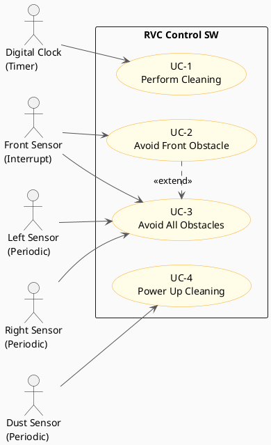
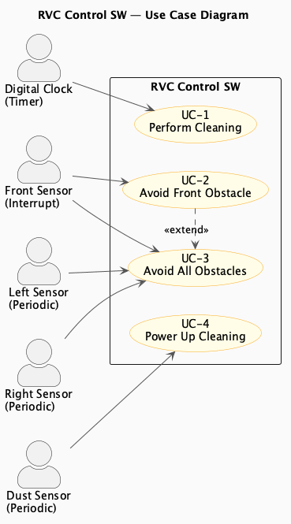

# Use Cases — RVC Control SW

> **Phase**: Inception  
> **Output**: Use Cases + Use Case Diagram

---

## Functional Requirements → Use Cases Mapping

| Ref. # | Functional Requirement | Use Case Number & Name | Category |
|--------|------------------------|------------------------|----------|
| FR-1, FR-2 | RVC가 바닥을 자동으로 청소하며 직진 이동한다 | UC-1: Perform Cleaning | Hidden |
| FR-3 | 전방 장애물 감지 시 회피 후 청소 재개 | UC-2: Avoid Front Obstacle | Evident |
| FR-4 | 전/좌/우 모두 장애물 시 후진 후 회피 | UC-3: Avoid All Obstacles | Evident |
| FR-5 | 먼지 감지 시 청소 파워업 | UC-4: Power Up Cleaning | Evident |

---

## Use Case Descriptions

### UC-1: Perform Cleaning

| Field | Content |
|-------|---------|
| **Use Case** | UC-1: Perform Cleaning |
| **Actors** | Digital Clock (Hidden) |
| **Type** | Primary, Hidden |
| **Overview** | RVC가 Tick 신호를 받아 장애물 없이 직진하며 청소를 수행한다 |
| **Pre-Requisites** | RVC가 동작 상태이며, 전방/좌/우 모두 장애물 없음 |
| **Typical Courses of Events** | 1. Digital Clock이 Tick 신호 발생   2. 센서 상태 확인 (전/좌/우 모두 False)   3. Direction: Forward 명령   4. Clean: On 명령 |
| **Alternative Courses of Events** | 없음 |
| **Exceptional Courses of Events** | 없음 |

---

### UC-2: Avoid Front Obstacle

| Field | Content |
|-------|---------|
| **Use Case** | UC-2: Avoid Front Obstacle |
| **Actors** | Front Sensor (Interrupt) |
| **Type** | Primary, Evident |
| **Overview** | 전방 장애물 감지 시 청소를 멈추고, 좌 또는 우로 방향 전환 후 청소를 재개한다 |
| **Pre-Requisites** | RVC가 청소 중이며, 좌측 또는 우측 중 하나는 열려 있음 |
| **Typical Courses of Events** | 1. Front Sensor가 장애물 감지 (True, Interrupt)   2. Clean: Off 명령   3. Direction: Left 또는 Right 명령   4. Direction: Forward 명령   5. Clean: On 명령 |
| **Alternative Courses of Events** | 좌/우 모두 막힌 경우 → UC-3 (Avoid All Obstacles) 실행 |
| **Exceptional Courses of Events** | 없음 |

---

### UC-3: Avoid All Obstacles

| Field | Content |
|-------|---------|
| **Use Case** | UC-3: Avoid All Obstacles |
| **Actors** | Front Sensor (Interrupt), Left Sensor (Periodic), Right Sensor (Periodic) |
| **Type** | Primary, Evident |
| **Overview** | 전방/좌/우 모두 장애물이 있을 때 후진 후 방향 전환하여 전진한다 |
| **Pre-Requisites** | Front Sensor, Left Sensor, Right Sensor 모두 True |
| **Typical Courses of Events** | 1. Front Sensor 장애물 감지 (True, Interrupt)   2. Left Sensor 확인 → True (Periodic)   3. Right Sensor 확인 → True (Periodic)   4. Clean: Off 명령   5. Direction: Backward 명령   6. Direction: Left 또는 Right 명령   7. Direction: Forward 명령   8. Clean: On 명령 |
| **Alternative Courses of Events** | 없음 |
| **Exceptional Courses of Events** | 없음 |

---

### UC-4: Power Up Cleaning

| Field | Content |
|-------|---------|
| **Use Case** | UC-4: Power Up Cleaning |
| **Actors** | Dust Sensor (Periodic) |
| **Type** | Primary, Evident |
| **Overview** | 먼지 감지 시 5분 동안 청소 파워를 높인다 |
| **Pre-Requisites** | RVC가 청소 중임 |
| **Typical Courses of Events** | 1. Dust Sensor가 먼지 감지 (True, Periodic)   2. Clean: Up 명령 (파워업)   3. 5분 경과 후 Clean: On으로 복귀 |
| **Alternative Courses of Events** | 없음 |
| **Exceptional Courses of Events** | 없음 |

---

## Use Case Diagram (PlantUML)

### Generated Diagram

