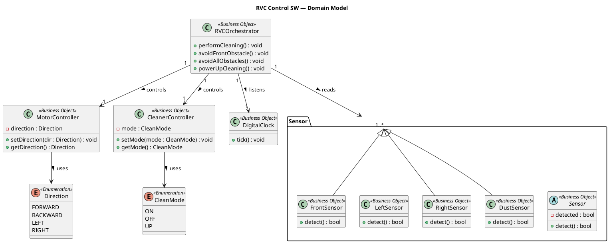
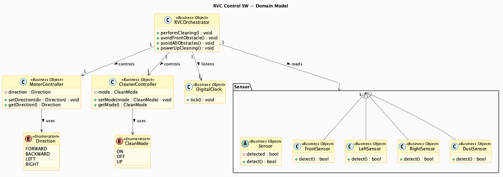

# Domain Model — RVC Control SW

> **Phase**: OOA in the 1st Elaboration  
> **Output**: Domain Model (개념 클래스 다이어그램)

---

## Overview

Domain Model은 문제 도메인의 **개념 클래스(Conceptual Class)** 와 그 관계를 표현합니다.  
구현 세부사항(메서드 구현, 언어 등)은 포함하지 않으며, 도메인 지식을 시각화합니다.

---

## 개념 클래스 식별

| 개념 클래스 | 설명 |
|------------|------|
| **RVCOrchestrator** | RVC 전체 청소 동작을 조율하는 핵심 제어 객체 |
| **Sensor** | 환경 감지 센서의 추상 개념 |
| **FrontSensor** | 전방 장애물 감지 (Interrupt 방식) |
| **LeftSensor** | 좌측 장애물 감지 (Periodic 방식) |
| **RightSensor** | 우측 장애물 감지 (Periodic 방식) |
| **DustSensor** | 바닥 먼지 감지 (Periodic 방식) |
| **MotorController** | RVC 이동 방향을 제어하는 모터 제어 객체 |
| **CleanerController** | 청소 기능(On/Off/Up)을 제어하는 객체 |
| **DigitalClock** | 주기적 Tick 신호를 제공하는 타이머 |
| **Direction** | 이동 방향 열거형 (FORWARD, BACKWARD, LEFT, RIGHT) |
| **CleanMode** | 청소 상태 열거형 (ON, OFF, UP) |

---

## PlantUML Code

---

## Diagram

---

## 관계 설명

| 관계 | From | To | 설명 |
|------|------|----|------|
| Generalization | FrontSensor, LeftSensor, RightSensor, DustSensor | Sensor | 센서 공통 개념 추상화 |
| Association | RVCOrchestrator | MotorController | 방향 제어 위임 |
| Association | RVCOrchestrator | CleanerController | 청소 제어 위임 |
| Association | RVCOrchestrator | Sensor (1..*) | 센서 값 읽기 |
| Association | RVCOrchestrator | DigitalClock | Tick 신호 수신 |
| Dependency | MotorController | Direction | 방향 열거형 사용 |
| Dependency | CleanerController | CleanMode | 청소 모드 열거형 사용 |
