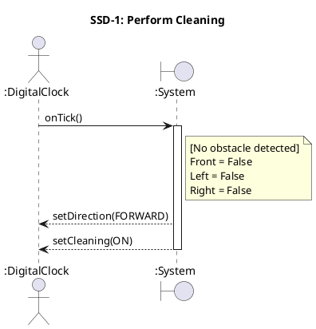
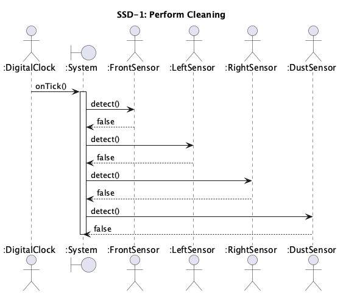
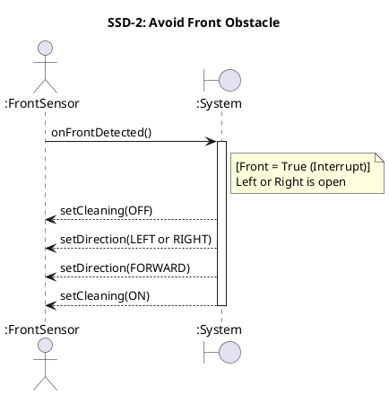
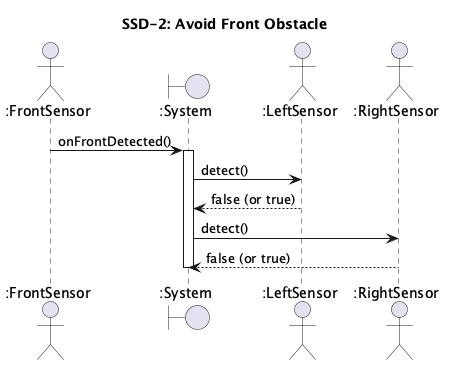
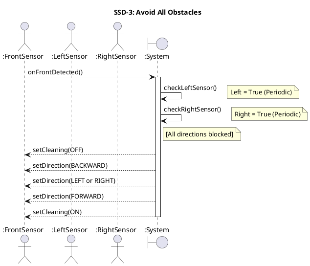
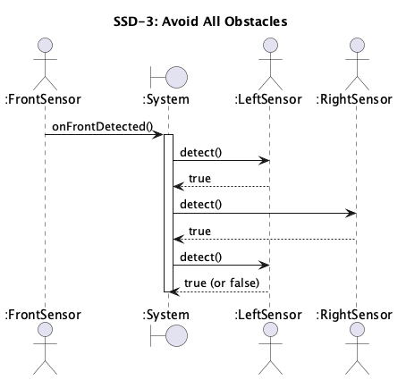
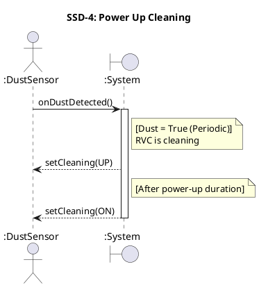
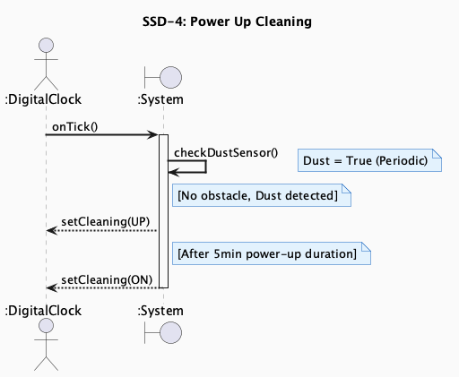

# System Sequence Diagrams (SSD) — RVC Control SW

> **Phase**: OOA in the 1st Elaboration  
> **Output**: System Sequence Diagrams → System Operations 도출

---

## Overview

SSD는 하나의 Use Case 시나리오 동안 외부 Actor와 시스템(:System) 사이의 이벤트 흐름을 표현합니다.  
SSD에서 도출된 시스템 메시지는 **System Operations(System Interface)** 로 정의됩니다.

---

## System Operations (System Interface)

```
<<Interface>>
RVCControlSystem
─────────────────────────────────────────
+ onTick()                      : void
+ onFrontDetected()             : void
+ onDustDetected(val : bool)    : void
```

> **참고**: LeftSensor / RightSensor는 SSD-3에서 `:System`이 내부적으로 `checkLeftSensor()` / `checkRightSensor()`를 **self-call**하는 구조입니다.  
> 외부 Actor가 System에 메시지를 보내는 것이 아니므로 System Operation으로 정의하지 않습니다.

---

## SSD-1: Perform Cleaning

### PlantUML Code



### Diagram



---

## SSD-2: Avoid Front Obstacle

### PlantUML Code



### Diagram



---

## SSD-3: Avoid All Obstacles

### PlantUML Code



### Diagram



---

## SSD-4: Power Up Cleaning

### PlantUML Code



### Diagram



---

## Traceability: Use Case → System Operation

| Use Case | System Operation | 비고 |
|----------|-----------------|------|
| UC-1: Perform Cleaning | `onTick()` | DigitalClock → System |
| UC-2: Avoid Front Obstacle | `onFrontDetected()` | FrontSensor → System (Interrupt) |
| UC-3: Avoid All Obstacles | `onFrontDetected()` | System이 내부적으로 Left/Right Sensor를 직접 poll |
| UC-4: Power Up Cleaning | `onDustDetected(val)` | DustSensor → System (Periodic) |
