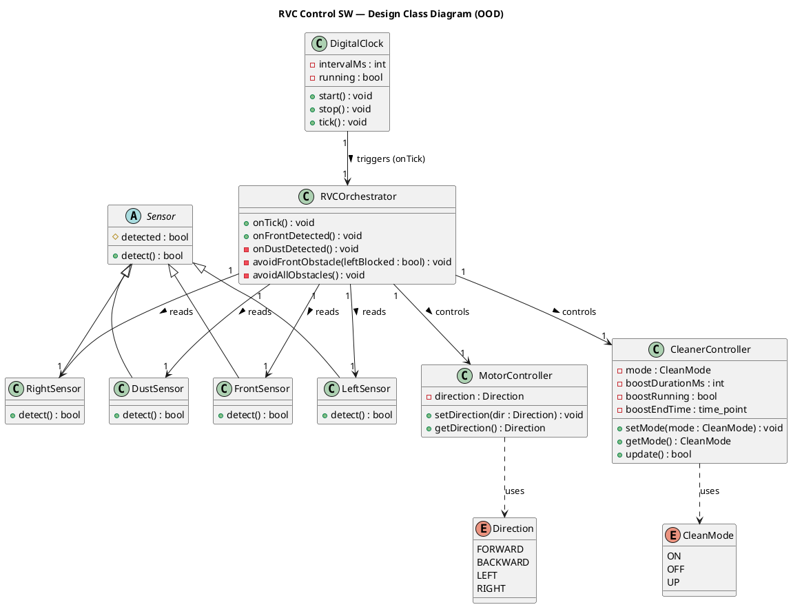
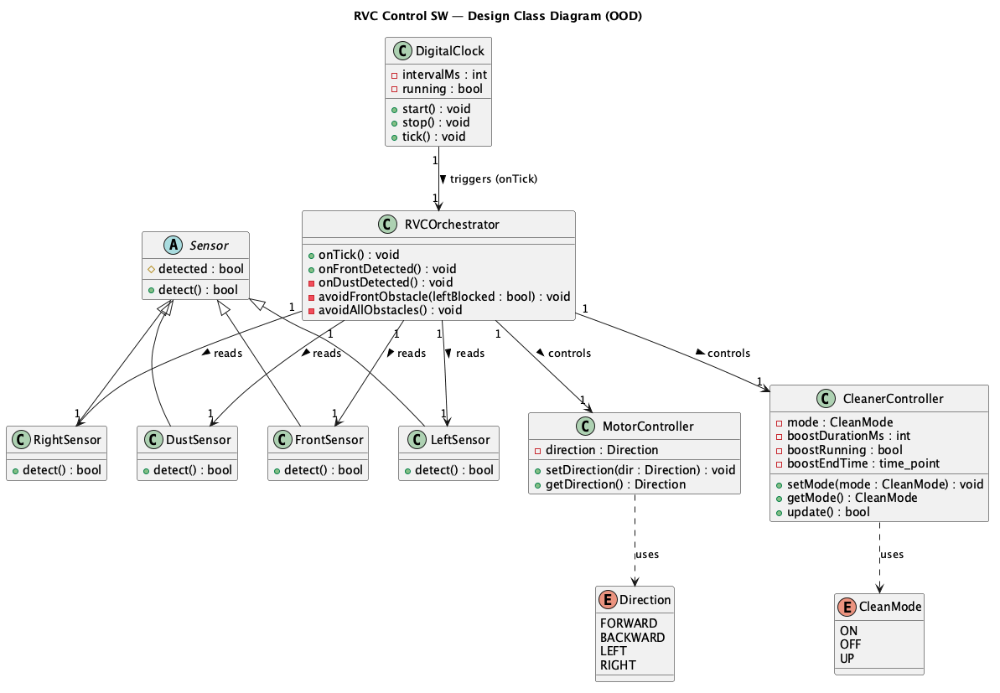

# Class Diagram (OOD) — RVC Control SW

> **Phase**: OOD in the 1st Elaboration  
> **Input**: `01-inception/requirements.mdx` + `02-ooa/domain-model.mdx` + `02-ooa/ssd.mdx`  
> **Output**: Design Class Diagram — 가시성, 타입, 메서드 시그니처를 추가한 설계 클래스 다이어그램

---

## Domain Model → Design Class 변환

| 개념 클래스 (OOA) | 설계 클래스 (OOD) | 추가된 설계 사항 | 도출 근거 |
|-----------------|-----------------|----------------|-----------|
| `RVCOrchestrator` | `RVCOrchestrator` | System Operations(`onTick`, `onFrontDetected`)를 public으로, `onDustDetected` / `avoidFrontObstacle` / `avoidAllObstacles`를 private으로 정의 | SSD System Operations + UC-2 Alt + UC-4 내부 poll |
| `Sensor` (abstract) | `Sensor` (abstract) | `# detected: bool`, `+ detect(): bool` | Domain Model + NFR-3 확장성 |
| `FrontSensor` / `LeftSensor` / `RightSensor` / `DustSensor` | 동일 | `+ detect(): bool` 구체 구현 | Domain Model |
| `MotorController` | `MotorController` | `setDirection()` / `getDirection()` 시그니처 확정 | Domain Model |
| `CleanerController` | `CleanerController` | `setMode()` / `getMode()` + 타이머 속성(`boostDurationMs`, `boostRunning`, `boostEndTime`) + `update(): bool` 추가 | Domain Model + FR-5 "일정 시간" |
| `DigitalClock` | `DigitalClock` | `intervalMs`, `start()`, `stop()`, `tick()` — 주기적 onTick() 호출 | 코드 구현 기준 |
| `Direction` enum | `Direction` | FORWARD / BACKWARD / LEFT / RIGHT | Domain Model + I/O Events |
| `CleanMode` enum | `CleanMode` | ON / OFF / UP | Domain Model + I/O Events |

---

## PlantUML Code

---

## Diagram

---

## 관계 설명

| 관계 | From | To | 도출 근거 |
|------|------|----|-----------|
| Generalization | FrontSensor / LeftSensor / RightSensor / DustSensor | Sensor | Domain Model + NFR-3 확장성 |
| Association (reads) | RVCOrchestrator | FrontSensor / LeftSensor / RightSensor / DustSensor | SD-1/SD-4: detect() 직접 호출 (onTick 내부 poll) |
| Association (triggers) | DigitalClock | RVCOrchestrator | onTick() 주기적 호출 |
| Association (controls) | RVCOrchestrator | MotorController | Domain Model — 방향 제어 위임 |
| Association (controls) | RVCOrchestrator | CleanerController | Domain Model — 청소 제어 위임 |
| Dependency (uses) | MotorController | Direction | Domain Model |
| Dependency (uses) | CleanerController | CleanMode | Domain Model |
