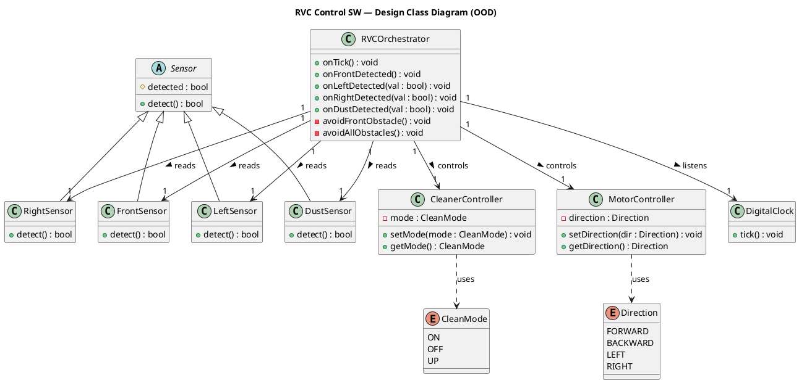

# Class Diagram (OOD) — RVC Control SW

> **Phase**: OOD in the 1st Elaboration  
> **Input**: Domain Model (02-ooa/domain-model.mdx) + Sequence Diagrams (03-ood/sequence-diagrams.mdx)  
> **Output**: Design Class Diagram — 가시성, 타입, 메서드 시그니처를 포함한 설계 클래스 다이어그램

---

## Overview

Domain Model의 개념 클래스를 바탕으로, Sequence Diagram에서 도출된 메서드와  
가시성(visibility), 타입을 추가하여 구현 가능한 설계 클래스 다이어그램을 작성합니다.

---

## Domain Model → Design Class 변환

| 개념 클래스 (OOA) | 설계 클래스 (OOD) | 추가된 설계 사항 |
|-----------------|-----------------|----------------|
| `RVCOrchestrator` | `RVCOrchestrator` | System Operations를 public 메서드로 정의 |
| `Sensor` (abstract) | `Sensor` (abstract) | `detect(): bool` 추상 메서드 |
| `FrontSensor` / `LeftSensor` / `RightSensor` / `DustSensor` | 동일 | `detect()` 구체 구현 |
| `MotorController` | `MotorController` | `setDirection()` / `getDirection()` 시그니처 확정 |
| `CleanerController` | `CleanerController` | `setMode()` / `getMode()` + 부스트 타이머 책임 |
| `DigitalClock` | `DigitalClock` | `tick()` — Orch에 onTick() 통보 |
| `Direction` (enum) | `Direction` | FORWARD / BACKWARD / LEFT / RIGHT |
| `CleanMode` (enum) | `CleanMode` | ON / OFF / UP |

---

## PlantUML Code

---

## Diagram

---

## 관계 설명

| 관계 | From | To | 설명 |
|------|------|----|------|
| Generalization (`<\|--`) | FrontSensor, LeftSensor, RightSensor, DustSensor | Sensor | 센서 계층 추상화 (NFR-3 확장성) |
| Association (`-->`) | RVCOrchestrator | MotorController | 이동 방향 제어 위임 |
| Association (`-->`) | RVCOrchestrator | CleanerController | 청소 모드 제어 위임 |
| Association (`-->`) | RVCOrchestrator | FrontSensor / LeftSensor / RightSensor | 장애물 감지 정보 읽기 |
| Association (`-->`) | RVCOrchestrator | DustSensor | 먼지 감지 정보 읽기 |
| Association (`-->`) | RVCOrchestrator | DigitalClock | Tick 신호 수신 |
| Dependency (`..>`) | MotorController | Direction | 방향 열거형 파라미터 사용 |
| Dependency (`..>`) | CleanerController | CleanMode | 청소 모드 열거형 파라미터 사용 |
