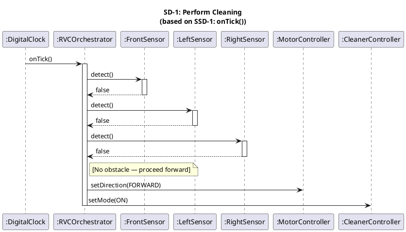
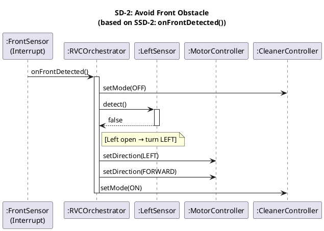
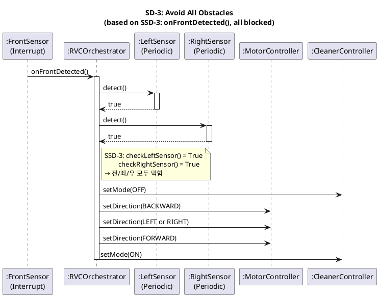
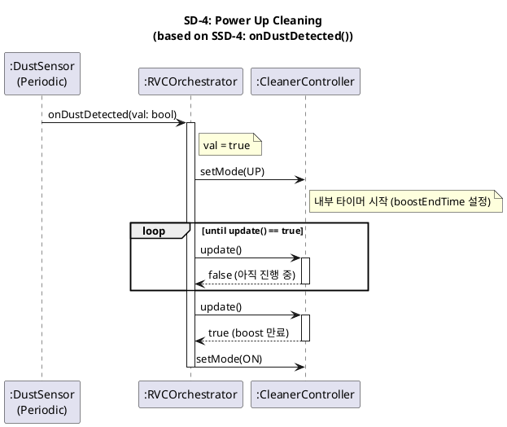

# Sequence Diagrams (OOD) — RVC Control SW

> **Phase**: OOD in the 1st Elaboration  
> **Input**: `01-inception/use-cases.mdx` + `02-ooa/ssd.mdx` + `02-ooa/domain-model.mdx`  
> **Output**: Design-level Sequence Diagrams — SSD의 `:System` 블랙박스를 Domain Model 클래스로 구체화

---

## Overview

SSD와 SD는 1:1 대응합니다. `:System` 블랙박스 내부를 Domain Model의 설계 클래스들로 분해합니다.

| SSD (OOA) | SD (OOD) | System Operation |
|-----------|----------|-----------------|
| SSD-1 | SD-1 | `onTick()` |
| SSD-2 | SD-2 | `onFrontDetected()` — 좌/우 열린 경우 |
| SSD-3 | SD-3 | `onFrontDetected()` — 전/좌/우 모두 막힌 경우 |
| SSD-4 | SD-4 | `onDustDetected(val)` |

---

## SD-1: Perform Cleaning

> **SSD-1 → SD-1**: `onTick()` 호출 시 `:System` 내부에서 FrontSensor 확인 후 전진/청소 명령.  
> UC-1 Typical Course: Tick → 센서 확인(전/좌/우 False) → Forward → On

### PlantUML Code

### Diagram

---

## SD-2: Avoid Front Obstacle

> **SSD-2 → SD-2**: `onFrontDetected()` 호출 시 청소 중단 → 열린 방향으로 회전 → 전진 → 청소 재개.  
> UC-2 Pre-Req: 좌 또는 우 중 하나는 열려있음.

### PlantUML Code

### Diagram

---

## SD-3: Avoid All Obstacles

> **SSD-3 → SD-3**: `onFrontDetected()` 호출 후 `:System` 내부의 `checkLeftSensor()` / `checkRightSensor()` 자기 호출을  
> `LeftSensor.detect()` / `RightSensor.detect()` 직접 호출로 구체화.  
> UC-3 Pre-Req: Front/Left/Right Sensor 모두 True → 후진 후 방향 전환.

### PlantUML Code

### Diagram

---

## SD-4: Power Up Cleaning

> **SSD-4 → SD-4**: `onDustDetected()` 호출 시 청소 파워업 후 일정 시간 경과 후 ON 복귀.  
> UC-4 Typical Course: Dust Sensor(True, Periodic) → Clean Up → 일정 시간 후 On.

### PlantUML Code

### Diagram

---

## Traceability: SSD → SD

| SSD (OOA) | SD (OOD) | `:System` 블랙박스 분해 |
|-----------|----------|------------------------|
| SSD-1: `onTick()` | SD-1 | RVCOrchestrator, FrontSensor, LeftSensor, RightSensor, MotorController, CleanerController |
| SSD-2: `onFrontDetected()` | SD-2 | RVCOrchestrator, LeftSensor, MotorController, CleanerController |
| SSD-3: `onFrontDetected()` all blocked | SD-3 | RVCOrchestrator, LeftSensor, RightSensor, MotorController, CleanerController |
| SSD-4: `onDustDetected()` | SD-4 | RVCOrchestrator, CleanerController |
