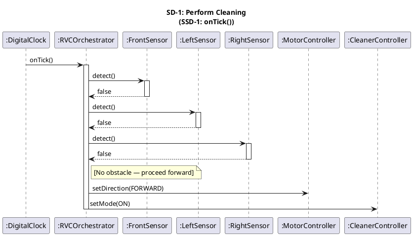
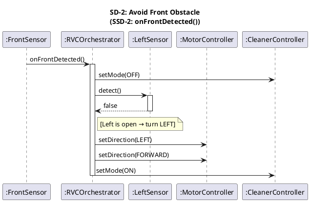
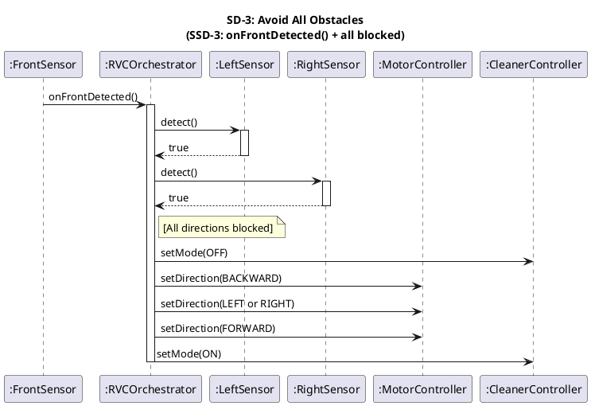
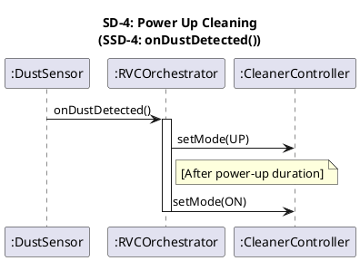

# Sequence Diagrams (OOD) — RVC Control SW

> **Phase**: OOD in the 1st Elaboration  
> **Input**: SSD-1~4 (02-ooa/ssd.mdx) + Domain Model (02-ooa/domain-model.mdx)  
> **Output**: Design-level Sequence Diagrams — `:System` 블랙박스를 내부 설계 객체로 구체화

---

## Overview

OOA의 SSD에서 `:System`으로 추상화된 블랙박스를 Domain Model의 설계 클래스들로 분해합니다.  
각 System Operation이 어떤 객체들 간의 메시지 흐름으로 실현되는지 표현합니다.

| SD | 기반 SSD | System Operation |
|----|----------|-----------------|
| SD-1 | SSD-1 | `onTick()` |
| SD-2 | SSD-2 | `onFrontDetected()` — 좌/우 열려있는 경우 |
| SD-3 | SSD-3 | `onFrontDetected()` — 전/좌/우 모두 막힌 경우 |
| SD-4 | SSD-4 | `onDustDetected()` |

---

## SD-1: Perform Cleaning

> SSD-1의 `onTick()` 호출 시, `:System` 내부에서 각 센서를 확인 후 전진/청소 명령을 전달한다.

### PlantUML Code

### Diagram

---

## SD-2: Avoid Front Obstacle

> SSD-2의 `onFrontDetected()` 호출 시, 좌측이 열려있으면 좌회전 후 전진한다.

### PlantUML Code

### Diagram

---

## SD-3: Avoid All Obstacles

> SSD-3의 `onFrontDetected()` 호출 시, 좌/우도 모두 막혀있으면 후진 후 방향 전환한다.

### PlantUML Code

### Diagram

---

## SD-4: Power Up Cleaning

> SSD-4의 `onDustDetected()` 호출 시, CleanerController에 UP 모드를 지시하고 일정 시간 후 ON으로 복귀한다.

### PlantUML Code

### Diagram

